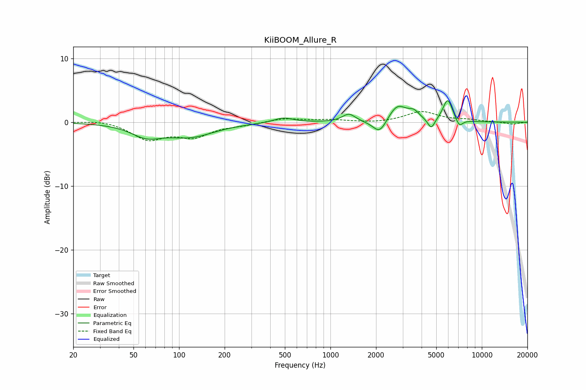

# KiiBOOM_Allure_R
See [usage instructions](https://github.com/jaakkopasanen/AutoEq#usage) for more options and info.

### Parametric EQs
Apply preamp of -3.4 dB when using parametric equalizer.

|   # | Type    |   Fc (Hz) |    Q |   Gain (dB) |
|-----|---------|-----------|------|-------------|
|   1 | Peaking |        61 | 1.42 |        -1.8 |
|   2 | Peaking |       119 | 0.89 |        -2.1 |
|   3 | Peaking |       489 | 2.21 |         0.8 |
|   4 | Peaking |      1324 | 3.34 |         1.3 |
|   5 | Peaking |      2118 | 3.07 |        -2.3 |
|   6 | Peaking |      2765 | 2.32 |         2.7 |
|   7 | Peaking |      3559 | 3.86 |         1.1 |
|   8 | Peaking |      4636 | 5.92 |        -1.7 |
|   9 | Peaking |      5949 | 4.35 |         3.5 |
|  10 | Peaking |      7108 | 5.95 |        -1.2 |

### Fixed Band EQs
When using fixed band (also called graphic) equalizer, apply preamp of **-1.8 dB** (if available) and set gains manually with these parameters.

|   # | Type    |   Fc (Hz) |    Q |   Gain (dB) |
|-----|---------|-----------|------|-------------|
|   1 | Peaking |        31 | 1.41 |         0.4 |
|   2 | Peaking |        62 | 1.41 |        -2.6 |
|   3 | Peaking |       125 | 1.41 |        -2.1 |
|   4 | Peaking |       250 | 1.41 |        -0.4 |
|   5 | Peaking |       500 | 1.41 |         0.6 |
|   6 | Peaking |      1000 | 1.41 |         0.3 |
|   7 | Peaking |      2000 | 1.41 |        -0.2 |
|   8 | Peaking |      4000 | 1.41 |         1.6 |
|   9 | Peaking |      8000 | 1.41 |         0.3 |
|  10 | Peaking |     16000 | 1.41 |        -0.3 |

### Graphs

