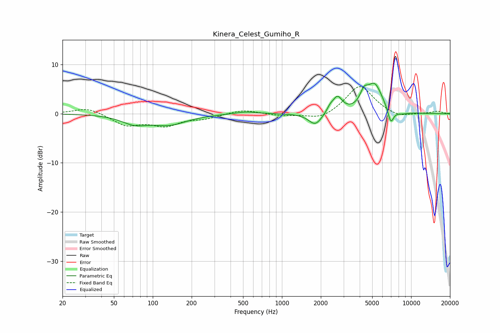

# Kinera_Celest_Gumiho_R
See [usage instructions](https://github.com/jaakkopasanen/AutoEq#usage) for more options and info.

### Parametric EQs
Apply preamp of -6.3 dB when using parametric equalizer.

|   # | Type    |   Fc (Hz) |    Q |   Gain (dB) |
|-----|---------|-----------|------|-------------|
|   1 | Peaking |        72 | 1.44 |        -1.7 |
|   2 | Peaking |       134 | 1.03 |        -2   |
|   3 | Peaking |       525 | 1.65 |         0.5 |
|   4 | Peaking |      1814 | 2.74 |        -2.5 |
|   5 | Peaking |      2354 | 5.98 |         0.9 |
|   6 | Peaking |      2686 | 3.8  |         3.2 |
|   7 | Peaking |      4314 | 4.74 |         2.4 |
|   8 | Peaking |      5209 | 2.25 |         5.8 |
|   9 | Peaking |      6959 | 5.86 |        -3.1 |
|  10 | Peaking |      8363 | 2.64 |        -0.5 |

### Fixed Band EQs
When using fixed band (also called graphic) equalizer, apply preamp of **-5.6 dB** (if available) and set gains manually with these parameters.

|   # | Type    |   Fc (Hz) |    Q |   Gain (dB) |
|-----|---------|-----------|------|-------------|
|   1 | Peaking |        31 | 1.41 |         1.3 |
|   2 | Peaking |        62 | 1.41 |        -2.3 |
|   3 | Peaking |       125 | 1.41 |        -2.2 |
|   4 | Peaking |       250 | 1.41 |        -0.8 |
|   5 | Peaking |       500 | 1.41 |         0.9 |
|   6 | Peaking |      1000 | 1.41 |        -0.4 |
|   7 | Peaking |      2000 | 1.41 |        -1.3 |
|   8 | Peaking |      4000 | 1.41 |         5.9 |
|   9 | Peaking |      8000 | 1.41 |        -0.9 |
|  10 | Peaking |     16000 | 1.41 |         0.5 |

### Graphs

