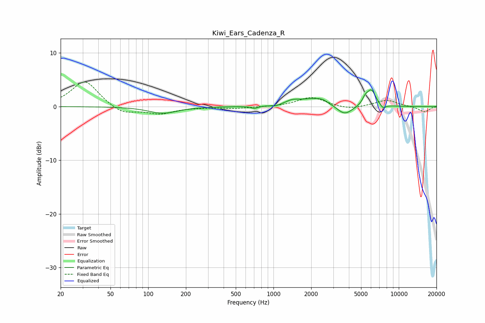

# Kiwi_Ears_Cadenza_R
See [usage instructions](https://github.com/jaakkopasanen/AutoEq#usage) for more options and info.

### Parametric EQs
Apply preamp of -3.2 dB when using parametric equalizer.

|   # | Type    |   Fc (Hz) |    Q |   Gain (dB) |
|-----|---------|-----------|------|-------------|
|   1 | Peaking |       131 | 1.24 |        -1.2 |
|   2 | Peaking |       704 | 5    |        -0.4 |
|   3 | Peaking |      1039 | 4.31 |        -0.3 |
|   4 | Peaking |      1414 | 2.62 |         0.7 |
|   5 | Peaking |      2163 | 1.22 |         1.5 |
|   6 | Peaking |      2469 | 4.55 |         0.3 |
|   7 | Peaking |      3688 | 2.21 |        -1.9 |
|   8 | Peaking |      5394 | 6    |         1.1 |
|   9 | Peaking |      6038 | 3.89 |         3   |
|  10 | Peaking |      7474 | 6    |        -0.8 |

### Fixed Band EQs
When using fixed band (also called graphic) equalizer, apply preamp of **-4.7 dB** (if available) and set gains manually with these parameters.

|   # | Type    |   Fc (Hz) |    Q |   Gain (dB) |
|-----|---------|-----------|------|-------------|
|   1 | Peaking |        31 | 1.41 |         4.9 |
|   2 | Peaking |        62 | 1.41 |        -1.5 |
|   3 | Peaking |       125 | 1.41 |        -1.3 |
|   4 | Peaking |       250 | 1.41 |        -0.1 |
|   5 | Peaking |       500 | 1.41 |        -0.3 |
|   6 | Peaking |      1000 | 1.41 |        -0   |
|   7 | Peaking |      2000 | 1.41 |         1.8 |
|   8 | Peaking |      4000 | 1.41 |        -0.6 |
|   9 | Peaking |      8000 | 1.41 |         1.2 |
|  10 | Peaking |     16000 | 1.41 |        -1   |

### Graphs

