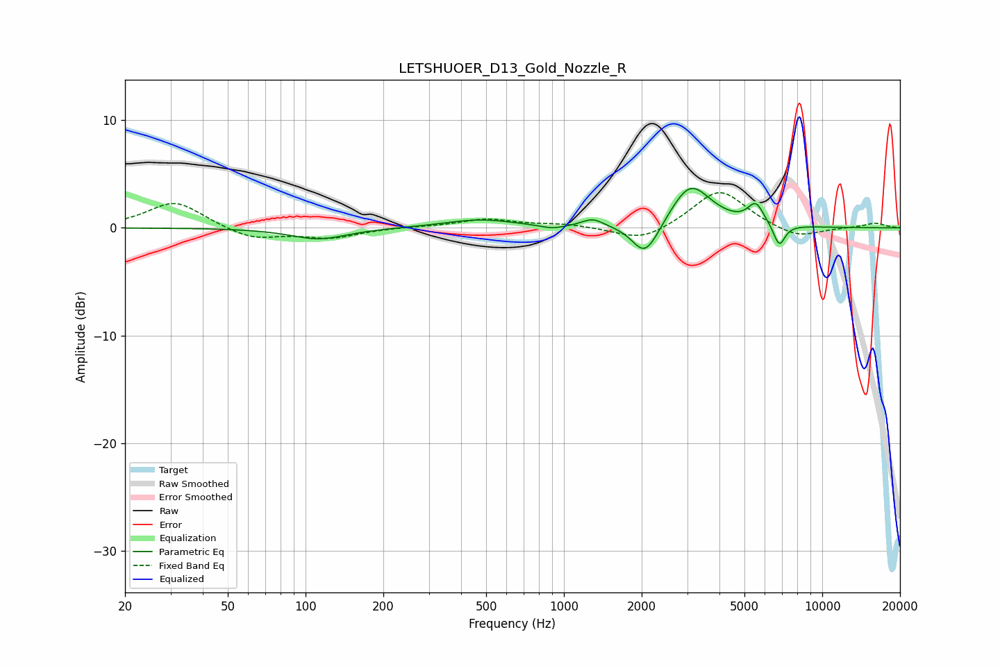

# LETSHUOER_D13_Gold_Nozzle_R
See [usage instructions](https://github.com/jaakkopasanen/AutoEq#usage) for more options and info.

### Parametric EQs
Apply preamp of -3.8 dB when using parametric equalizer.

|   # | Type    |   Fc (Hz) |    Q |   Gain (dB) |
|-----|---------|-----------|------|-------------|
|   1 | Peaking |       113 | 1.29 |        -1.1 |
|   2 | Peaking |       472 | 1.04 |         0.8 |
|   3 | Peaking |       902 | 2.96 |        -0.3 |
|   4 | Peaking |      1292 | 3.29 |         0.8 |
|   5 | Peaking |      2041 | 2.94 |        -2.6 |
|   6 | Peaking |      2245 | 2.74 |        -0.7 |
|   7 | Peaking |      3079 | 1.91 |         3.5 |
|   8 | Peaking |      3315 | 1.29 |         0.6 |
|   9 | Peaking |      5532 | 4.49 |         1.9 |
|  10 | Peaking |      6816 | 6    |        -2.1 |

### Fixed Band EQs
When using fixed band (also called graphic) equalizer, apply preamp of **-3.4 dB** (if available) and set gains manually with these parameters.

|   # | Type    |   Fc (Hz) |    Q |   Gain (dB) |
|-----|---------|-----------|------|-------------|
|   1 | Peaking |        31 | 1.41 |         2.5 |
|   2 | Peaking |        62 | 1.41 |        -1.1 |
|   3 | Peaking |       125 | 1.41 |        -0.9 |
|   4 | Peaking |       250 | 1.41 |         0.1 |
|   5 | Peaking |       500 | 1.41 |         0.8 |
|   6 | Peaking |      1000 | 1.41 |         0.3 |
|   7 | Peaking |      2000 | 1.41 |        -1.3 |
|   8 | Peaking |      4000 | 1.41 |         3.6 |
|   9 | Peaking |      8000 | 1.41 |        -1   |
|  10 | Peaking |     16000 | 1.41 |         0.4 |

### Graphs

