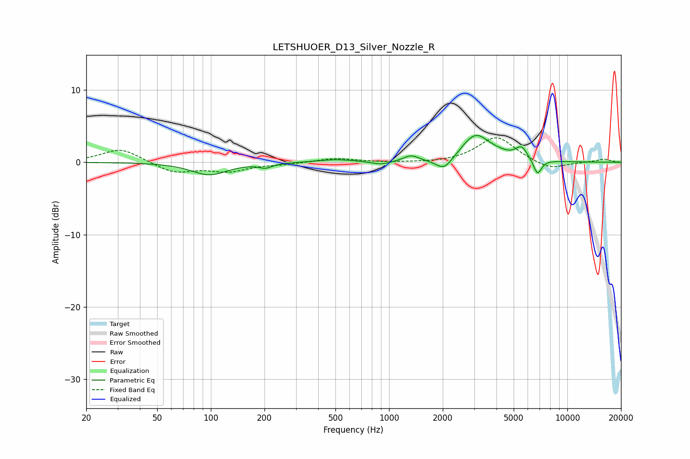

# LETSHUOER_D13_Silver_Nozzle_R
See [usage instructions](https://github.com/jaakkopasanen/AutoEq#usage) for more options and info.

### Parametric EQs
Apply preamp of -3.8 dB when using parametric equalizer.

|   # | Type    |   Fc (Hz) |    Q |   Gain (dB) |
|-----|---------|-----------|------|-------------|
|   1 | Peaking |        98 | 1.43 |        -1.7 |
|   2 | Peaking |       203 | 4.03 |        -0.6 |
|   3 | Peaking |       503 | 1.43 |         0.4 |
|   4 | Peaking |       903 | 2.79 |        -0.5 |
|   5 | Peaking |      1329 | 3.35 |         0.8 |
|   6 | Peaking |      2038 | 2.97 |        -1.8 |
|   7 | Peaking |      3049 | 1.82 |         3.6 |
|   8 | Peaking |      4097 | 1.58 |         0.5 |
|   9 | Peaking |      5531 | 4.25 |         1.6 |
|  10 | Peaking |      6802 | 5.97 |        -2.1 |

### Fixed Band EQs
When using fixed band (also called graphic) equalizer, apply preamp of **-3.5 dB** (if available) and set gains manually with these parameters.

|   # | Type    |   Fc (Hz) |    Q |   Gain (dB) |
|-----|---------|-----------|------|-------------|
|   1 | Peaking |        31 | 1.41 |         1.9 |
|   2 | Peaking |        62 | 1.41 |        -1.4 |
|   3 | Peaking |       125 | 1.41 |        -1.2 |
|   4 | Peaking |       250 | 1.41 |        -0.2 |
|   5 | Peaking |       500 | 1.41 |         0.6 |
|   6 | Peaking |      1000 | 1.41 |        -0.1 |
|   7 | Peaking |      2000 | 1.41 |        -0.1 |
|   8 | Peaking |      4000 | 1.41 |         3.5 |
|   9 | Peaking |      8000 | 1.41 |        -1.1 |
|  10 | Peaking |     16000 | 1.41 |         0.4 |

### Graphs

