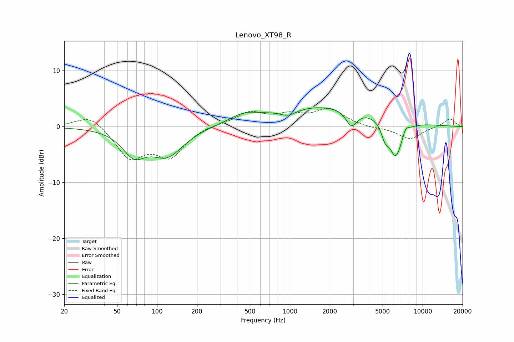

# Lenovo_XT98_R
See [usage instructions](https://github.com/jaakkopasanen/AutoEq#usage) for more options and info.

### Parametric EQs
Apply preamp of -3.5 dB when using parametric equalizer.

|   # | Type    |   Fc (Hz) |    Q |   Gain (dB) |
|-----|---------|-----------|------|-------------|
|   1 | Peaking |        67 | 1.63 |        -4.2 |
|   2 | Peaking |       120 | 1.15 |        -4.9 |
|   3 | Peaking |       456 | 1.38 |         1.3 |
|   4 | Peaking |       570 | 2.09 |        -0.1 |
|   5 | Peaking |       968 | 2.28 |        -1.2 |
|   6 | Peaking |      1911 | 0.29 |         3.8 |
|   7 | Peaking |      2911 | 3.34 |        -3   |
|   8 | Peaking |      5208 | 5.06 |        -2.2 |
|   9 | Peaking |      6270 | 2.63 |        -6.9 |
|  10 | Peaking |      7454 | 5.42 |         1.3 |

### Fixed Band EQs
When using fixed band (also called graphic) equalizer, apply preamp of **-3.4 dB** (if available) and set gains manually with these parameters.

|   # | Type    |   Fc (Hz) |    Q |   Gain (dB) |
|-----|---------|-----------|------|-------------|
|   1 | Peaking |        31 | 1.41 |         2.3 |
|   2 | Peaking |        62 | 1.41 |        -5.4 |
|   3 | Peaking |       125 | 1.41 |        -5   |
|   4 | Peaking |       250 | 1.41 |         0.4 |
|   5 | Peaking |       500 | 1.41 |         2.4 |
|   6 | Peaking |      1000 | 1.41 |         1.7 |
|   7 | Peaking |      2000 | 1.41 |         3   |
|   8 | Peaking |      4000 | 1.41 |        -0.3 |
|   9 | Peaking |      8000 | 1.41 |        -2.2 |
|  10 | Peaking |     16000 | 1.41 |         1.5 |

### Graphs

