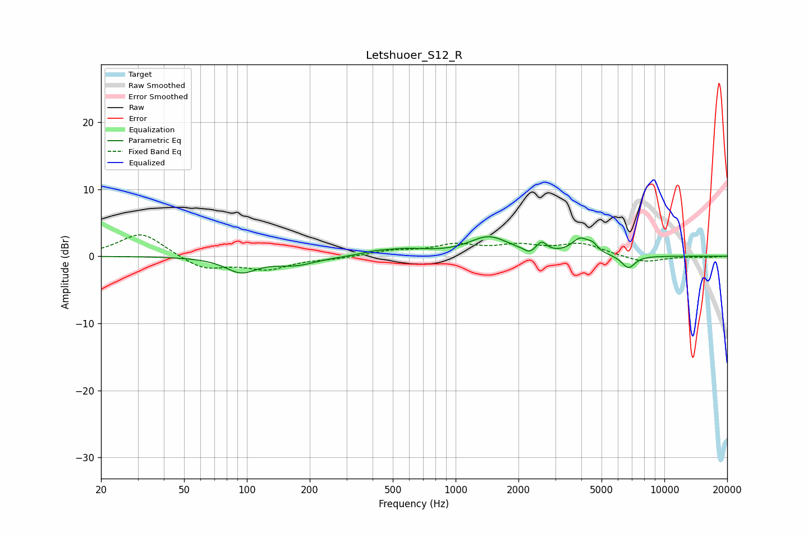

# Letshuoer_S12_R
See [usage instructions](https://github.com/jaakkopasanen/AutoEq#usage) for more options and info.

### Parametric EQs
Apply preamp of -3.0 dB when using parametric equalizer.

|   # | Type    |   Fc (Hz) |    Q |   Gain (dB) |
|-----|---------|-----------|------|-------------|
|   1 | Peaking |        94 | 1.89 |        -2.2 |
|   2 | Peaking |       171 | 1.4  |        -1.2 |
|   3 | Peaking |       406 | 2.57 |         0.3 |
|   4 | Peaking |       563 | 1.18 |         0.9 |
|   5 | Peaking |      1444 | 1.51 |         2.8 |
|   6 | Peaking |      2253 | 6    |        -0.7 |
|   7 | Peaking |      2584 | 5.99 |         1.4 |
|   8 | Peaking |      3958 | 3.37 |         2.3 |
|   9 | Peaking |      4539 | 5.99 |         1   |
|  10 | Peaking |      6724 | 4.26 |        -1.9 |

### Fixed Band EQs
When using fixed band (also called graphic) equalizer, apply preamp of **-3.3 dB** (if available) and set gains manually with these parameters.

|   # | Type    |   Fc (Hz) |    Q |   Gain (dB) |
|-----|---------|-----------|------|-------------|
|   1 | Peaking |        31 | 1.41 |         3.6 |
|   2 | Peaking |        62 | 1.41 |        -2   |
|   3 | Peaking |       125 | 1.41 |        -1.8 |
|   4 | Peaking |       250 | 1.41 |        -0.3 |
|   5 | Peaking |       500 | 1.41 |         0.7 |
|   6 | Peaking |      1000 | 1.41 |         1.5 |
|   7 | Peaking |      2000 | 1.41 |         1.4 |
|   8 | Peaking |      4000 | 1.41 |         1.8 |
|   9 | Peaking |      8000 | 1.41 |        -1   |
|  10 | Peaking |     16000 | 1.41 |        -0.1 |

### Graphs

