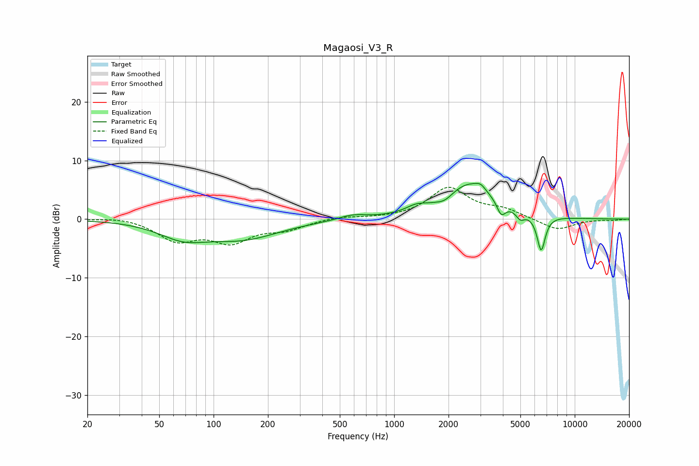

# Magaosi_V3_R
See [usage instructions](https://github.com/jaakkopasanen/AutoEq#usage) for more options and info.

### Parametric EQs
Apply preamp of -6.2 dB when using parametric equalizer.

|   # | Type    |   Fc (Hz) |    Q |   Gain (dB) |
|-----|---------|-----------|------|-------------|
|   1 | Peaking |        67 | 1.07 |        -2.5 |
|   2 | Peaking |       145 | 0.68 |        -3.1 |
|   3 | Peaking |       588 | 1.92 |         0.8 |
|   4 | Peaking |      1321 | 2.52 |         1   |
|   5 | Peaking |      1906 | 3.14 |        -1   |
|   6 | Peaking |      2600 | 1.04 |         6   |
|   7 | Peaking |      3011 | 5.14 |         0.8 |
|   8 | Peaking |      3916 | 5.98 |        -2.3 |
|   9 | Peaking |      4998 | 6    |        -1.3 |
|  10 | Peaking |      6518 | 6    |        -6.1 |

### Fixed Band EQs
When using fixed band (also called graphic) equalizer, apply preamp of **-5.5 dB** (if available) and set gains manually with these parameters.

|   # | Type    |   Fc (Hz) |    Q |   Gain (dB) |
|-----|---------|-----------|------|-------------|
|   1 | Peaking |        31 | 1.41 |         0.4 |
|   2 | Peaking |        62 | 1.41 |        -3.4 |
|   3 | Peaking |       125 | 1.41 |        -3.5 |
|   4 | Peaking |       250 | 1.41 |        -1.5 |
|   5 | Peaking |       500 | 1.41 |         0.5 |
|   6 | Peaking |      1000 | 1.41 |         0.1 |
|   7 | Peaking |      2000 | 1.41 |         5.2 |
|   8 | Peaking |      4000 | 1.41 |         1.4 |
|   9 | Peaking |      8000 | 1.41 |        -1.9 |
|  10 | Peaking |     16000 | 1.41 |        -0.2 |

### Graphs

