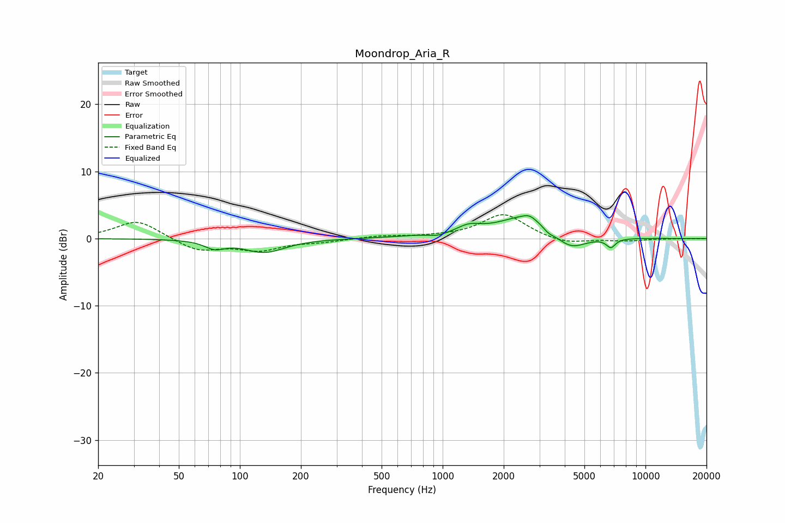

# Moondrop_Aria_R
See [usage instructions](https://github.com/jaakkopasanen/AutoEq#usage) for more options and info.

### Parametric EQs
Apply preamp of -3.5 dB when using parametric equalizer.

|   # | Type    |   Fc (Hz) |    Q |   Gain (dB) |
|-----|---------|-----------|------|-------------|
|   1 | Peaking |        75 | 2.92 |        -1.2 |
|   2 | Peaking |       132 | 1.4  |        -2   |
|   3 | Peaking |       721 | 1.18 |         0.2 |
|   4 | Peaking |       945 | 3.39 |        -0.4 |
|   5 | Peaking |      1346 | 2.35 |         1.2 |
|   6 | Peaking |      2583 | 1.02 |         3.4 |
|   7 | Peaking |      2673 | 4.74 |         0.6 |
|   8 | Peaking |      3325 | 4.93 |        -0.7 |
|   9 | Peaking |      4251 | 1.8  |        -2.5 |
|  10 | Peaking |      6755 | 6    |        -1.3 |

### Fixed Band EQs
When using fixed band (also called graphic) equalizer, apply preamp of **-3.6 dB** (if available) and set gains manually with these parameters.

|   # | Type    |   Fc (Hz) |    Q |   Gain (dB) |
|-----|---------|-----------|------|-------------|
|   1 | Peaking |        31 | 1.41 |         2.8 |
|   2 | Peaking |        62 | 1.41 |        -1.9 |
|   3 | Peaking |       125 | 1.41 |        -1.6 |
|   4 | Peaking |       250 | 1.41 |        -0.4 |
|   5 | Peaking |       500 | 1.41 |         0.4 |
|   6 | Peaking |      1000 | 1.41 |         0.2 |
|   7 | Peaking |      2000 | 1.41 |         3.7 |
|   8 | Peaking |      4000 | 1.41 |        -0.9 |
|   9 | Peaking |      8000 | 1.41 |        -0.3 |
|  10 | Peaking |     16000 | 1.41 |        -0   |

### Graphs

