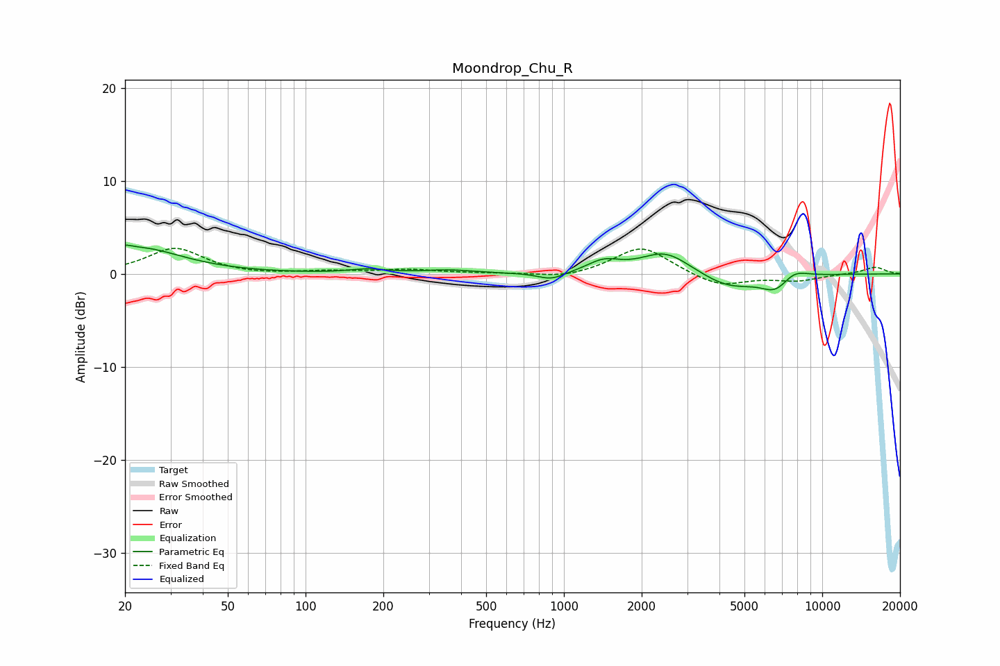

# Moondrop_Chu_R
See [usage instructions](https://github.com/jaakkopasanen/AutoEq#usage) for more options and info.

### Parametric EQs
Apply preamp of -3.2 dB when using parametric equalizer.

|   # | Type    |   Fc (Hz) |    Q |   Gain (dB) |
|-----|---------|-----------|------|-------------|
|   1 | Peaking |        20 | 5.96 |         0.4 |
|   2 | Peaking |        22 | 0.84 |         2.8 |
|   3 | Peaking |       174 | 2.01 |         0.4 |
|   4 | Peaking |       358 | 1.49 |         0.4 |
|   5 | Peaking |       894 | 2.66 |        -0.8 |
|   6 | Peaking |      1425 | 2.25 |         1.2 |
|   7 | Peaking |      2472 | 1.48 |         2.4 |
|   8 | Peaking |      4350 | 1.31 |        -1.6 |
|   9 | Peaking |      6608 | 2.4  |        -1.7 |
|  10 | Peaking |      7739 | 2.51 |         1   |

### Fixed Band EQs
When using fixed band (also called graphic) equalizer, apply preamp of **-2.8 dB** (if available) and set gains manually with these parameters.

|   # | Type    |   Fc (Hz) |    Q |   Gain (dB) |
|-----|---------|-----------|------|-------------|
|   1 | Peaking |        31 | 1.41 |         2.8 |
|   2 | Peaking |        62 | 1.41 |        -0.1 |
|   3 | Peaking |       125 | 1.41 |         0.3 |
|   4 | Peaking |       250 | 1.41 |         0.4 |
|   5 | Peaking |       500 | 1.41 |         0.1 |
|   6 | Peaking |      1000 | 1.41 |        -0.5 |
|   7 | Peaking |      2000 | 1.41 |         3   |
|   8 | Peaking |      4000 | 1.41 |        -1.4 |
|   9 | Peaking |      8000 | 1.41 |        -0.7 |
|  10 | Peaking |     16000 | 1.41 |         0.7 |

### Graphs

