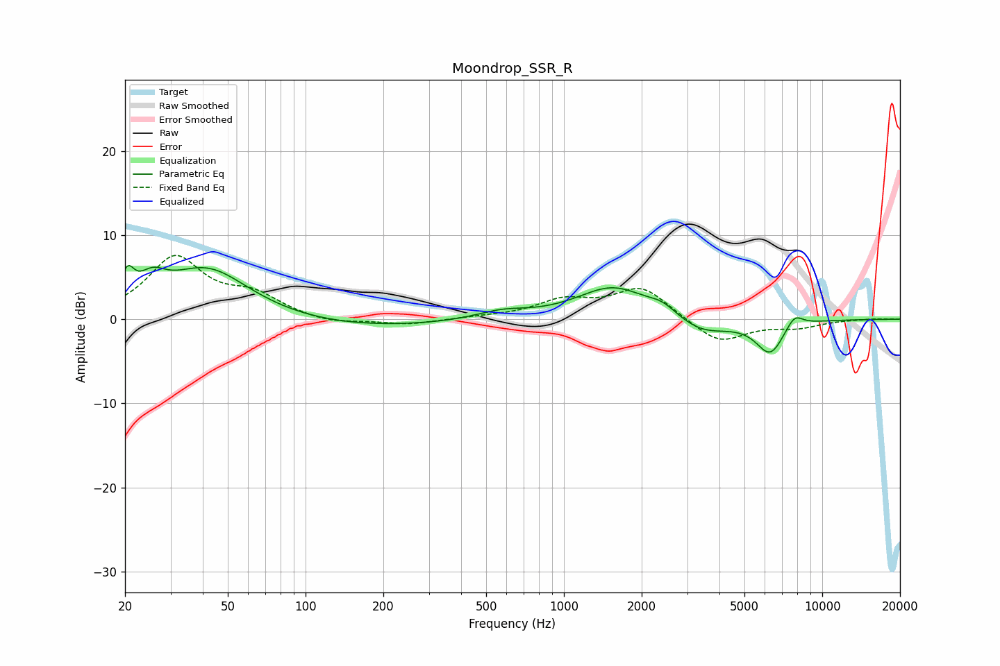

# Moondrop_SSR_R
See [usage instructions](https://github.com/jaakkopasanen/AutoEq#usage) for more options and info.

### Parametric EQs
Apply preamp of -6.5 dB when using parametric equalizer.

|   # | Type    |   Fc (Hz) |    Q |   Gain (dB) |
|-----|---------|-----------|------|-------------|
|   1 | Peaking |        20 | 5.63 |         3.2 |
|   2 | Peaking |        25 | 2.73 |         2.4 |
|   3 | Peaking |        42 | 0.85 |         6.1 |
|   4 | Peaking |       155 | 0.4  |        -1.1 |
|   5 | Peaking |       574 | 1.41 |         0.9 |
|   6 | Peaking |      1551 | 1.02 |         3.9 |
|   7 | Peaking |      2415 | 2.55 |         1.1 |
|   8 | Peaking |      3418 | 1.3  |        -2   |
|   9 | Peaking |      6287 | 2.51 |        -4   |
|  10 | Peaking |      7799 | 3.93 |         1.6 |

### Fixed Band EQs
When using fixed band (also called graphic) equalizer, apply preamp of **-7.7 dB** (if available) and set gains manually with these parameters.

|   # | Type    |   Fc (Hz) |    Q |   Gain (dB) |
|-----|---------|-----------|------|-------------|
|   1 | Peaking |        31 | 1.41 |         7.2 |
|   2 | Peaking |        62 | 1.41 |         2.4 |
|   3 | Peaking |       125 | 1.41 |        -0.7 |
|   4 | Peaking |       250 | 1.41 |        -0.7 |
|   5 | Peaking |       500 | 1.41 |         0.2 |
|   6 | Peaking |      1000 | 1.41 |         2   |
|   7 | Peaking |      2000 | 1.41 |         3.8 |
|   8 | Peaking |      4000 | 1.41 |        -2.9 |
|   9 | Peaking |      8000 | 1.41 |        -0.9 |
|  10 | Peaking |     16000 | 1.41 |         0.1 |

### Graphs

