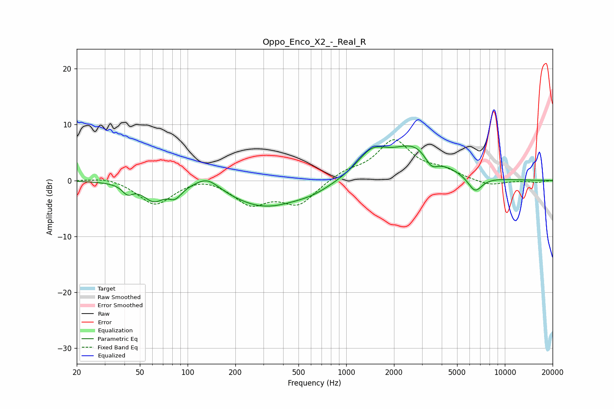

# Oppo_Enco_X2_-_Real_R
See [usage instructions](https://github.com/jaakkopasanen/AutoEq#usage) for more options and info.

### Parametric EQs
Apply preamp of -6.3 dB when using parametric equalizer.

|   # | Type    |   Fc (Hz) |    Q |   Gain (dB) |
|-----|---------|-----------|------|-------------|
|   1 | Peaking |        42 | 4.37 |        -1.6 |
|   2 | Peaking |        61 | 2.14 |        -3.1 |
|   3 | Peaking |        83 | 3.49 |        -1.9 |
|   4 | Peaking |       133 | 1.82 |         2.3 |
|   5 | Peaking |       304 | 0.62 |        -4.7 |
|   6 | Peaking |       616 | 1.17 |        -1   |
|   7 | Peaking |      1451 | 1.46 |         4.2 |
|   8 | Peaking |      2742 | 0.94 |         6   |
|   9 | Peaking |      3438 | 3.2  |        -2.5 |
|  10 | Peaking |      6484 | 2.93 |        -2.9 |

### Fixed Band EQs
When using fixed band (also called graphic) equalizer, apply preamp of **-7.4 dB** (if available) and set gains manually with these parameters.

|   # | Type    |   Fc (Hz) |    Q |   Gain (dB) |
|-----|---------|-----------|------|-------------|
|   1 | Peaking |        31 | 1.41 |         0.7 |
|   2 | Peaking |        62 | 1.41 |        -4.4 |
|   3 | Peaking |       125 | 1.41 |         1   |
|   4 | Peaking |       250 | 1.41 |        -4   |
|   5 | Peaking |       500 | 1.41 |        -4.1 |
|   6 | Peaking |      1000 | 1.41 |         1.4 |
|   7 | Peaking |      2000 | 1.41 |         7   |
|   8 | Peaking |      4000 | 1.41 |         1.5 |
|   9 | Peaking |      8000 | 1.41 |        -1   |
|  10 | Peaking |     16000 | 1.41 |        -0.3 |

### Graphs

