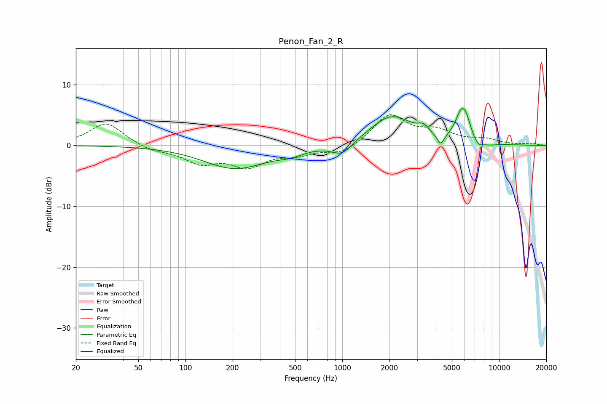

# Penon_Fan_2_R
See [usage instructions](https://github.com/jaakkopasanen/AutoEq#usage) for more options and info.

### Parametric EQs
Apply preamp of -6.2 dB when using parametric equalizer.

|   # | Type    |   Fc (Hz) |    Q |   Gain (dB) |
|-----|---------|-----------|------|-------------|
|   1 | Peaking |       207 | 0.71 |        -3.8 |
|   2 | Peaking |       468 | 1.66 |        -0.8 |
|   3 | Peaking |       999 | 2.11 |        -2.1 |
|   4 | Peaking |      2066 | 1.02 |         4.9 |
|   5 | Peaking |      3287 | 4.26 |         1.2 |
|   6 | Peaking |      4242 | 6    |        -1.9 |
|   7 | Peaking |      5791 | 3.46 |         5.2 |
|   8 | Peaking |      6246 | 5.87 |         1.1 |
|   9 | Peaking |      7378 | 4.51 |        -1.1 |
|  10 | Peaking |      8645 | 2.68 |        -0.4 |

### Fixed Band EQs
When using fixed band (also called graphic) equalizer, apply preamp of **-5.1 dB** (if available) and set gains manually with these parameters.

|   # | Type    |   Fc (Hz) |    Q |   Gain (dB) |
|-----|---------|-----------|------|-------------|
|   1 | Peaking |        31 | 1.41 |         3.8 |
|   2 | Peaking |        62 | 1.41 |        -0.9 |
|   3 | Peaking |       125 | 1.41 |        -2.6 |
|   4 | Peaking |       250 | 1.41 |        -3.1 |
|   5 | Peaking |       500 | 1.41 |        -1.3 |
|   6 | Peaking |      1000 | 1.41 |        -1.5 |
|   7 | Peaking |      2000 | 1.41 |         5   |
|   8 | Peaking |      4000 | 1.41 |         2   |
|   9 | Peaking |      8000 | 1.41 |         0.9 |
|  10 | Peaking |     16000 | 1.41 |         0.3 |

### Graphs

