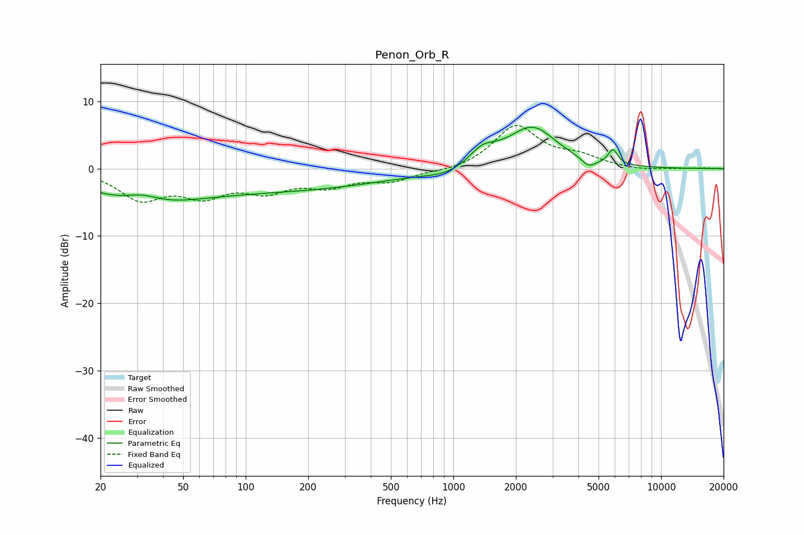

# Penon_Orb_R
See [usage instructions](https://github.com/jaakkopasanen/AutoEq#usage) for more options and info.

### Parametric EQs
Apply preamp of -6.3 dB when using parametric equalizer.

|   # | Type    |   Fc (Hz) |    Q |   Gain (dB) |
|-----|---------|-----------|------|-------------|
|   1 | Peaking |        31 | 0.58 |        -4.5 |
|   2 | Peaking |        32 | 1.6  |         1.7 |
|   3 | Peaking |       154 | 0.29 |        -3   |
|   4 | Peaking |       855 | 1.2  |        -0.2 |
|   5 | Peaking |       940 | 1.45 |        -0.8 |
|   6 | Peaking |      1368 | 2.42 |         1.7 |
|   7 | Peaking |      1536 | 1.43 |         0.7 |
|   8 | Peaking |      2408 | 1.22 |         6   |
|   9 | Peaking |      4483 | 4.17 |        -1.2 |
|  10 | Peaking |      5865 | 6    |         2.2 |

### Fixed Band EQs
When using fixed band (also called graphic) equalizer, apply preamp of **-6.5 dB** (if available) and set gains manually with these parameters.

|   # | Type    |   Fc (Hz) |    Q |   Gain (dB) |
|-----|---------|-----------|------|-------------|
|   1 | Peaking |        31 | 1.41 |        -4.2 |
|   2 | Peaking |        62 | 1.41 |        -3.4 |
|   3 | Peaking |       125 | 1.41 |        -2.8 |
|   4 | Peaking |       250 | 1.41 |        -2.2 |
|   5 | Peaking |       500 | 1.41 |        -1.7 |
|   6 | Peaking |      1000 | 1.41 |        -0.5 |
|   7 | Peaking |      2000 | 1.41 |         6.3 |
|   8 | Peaking |      4000 | 1.41 |         1.5 |
|   9 | Peaking |      8000 | 1.41 |        -0.3 |
|  10 | Peaking |     16000 | 1.41 |         0.1 |

### Graphs

