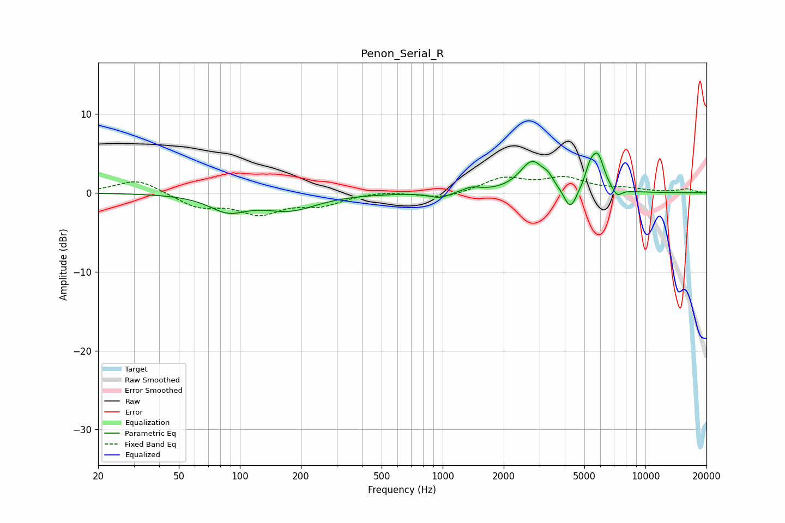

# Penon_Serial_R
See [usage instructions](https://github.com/jaakkopasanen/AutoEq#usage) for more options and info.

### Parametric EQs
Apply preamp of -5.2 dB when using parametric equalizer.

|   # | Type    |   Fc (Hz) |    Q |   Gain (dB) |
|-----|---------|-----------|------|-------------|
|   1 | Peaking |        87 | 1.53 |        -2   |
|   2 | Peaking |       176 | 1.04 |        -2   |
|   3 | Peaking |       967 | 3.06 |        -0.7 |
|   4 | Peaking |      1389 | 3.3  |         0.6 |
|   5 | Peaking |      2765 | 2.34 |         3.9 |
|   6 | Peaking |      3307 | 5.99 |         0.7 |
|   7 | Peaking |      4263 | 4.42 |        -2.9 |
|   8 | Peaking |      5322 | 5.95 |         1.9 |
|   9 | Peaking |      5822 | 4.35 |         4.4 |
|  10 | Peaking |      7236 | 5.74 |        -1   |

### Fixed Band EQs
When using fixed band (also called graphic) equalizer, apply preamp of **-2.2 dB** (if available) and set gains manually with these parameters.

|   # | Type    |   Fc (Hz) |    Q |   Gain (dB) |
|-----|---------|-----------|------|-------------|
|   1 | Peaking |        31 | 1.41 |         1.8 |
|   2 | Peaking |        62 | 1.41 |        -1.7 |
|   3 | Peaking |       125 | 1.41 |        -2.4 |
|   4 | Peaking |       250 | 1.41 |        -1.4 |
|   5 | Peaking |       500 | 1.41 |         0.3 |
|   6 | Peaking |      1000 | 1.41 |        -0.8 |
|   7 | Peaking |      2000 | 1.41 |         1.8 |
|   8 | Peaking |      4000 | 1.41 |         1.7 |
|   9 | Peaking |      8000 | 1.41 |         0.4 |
|  10 | Peaking |     16000 | 1.41 |         0.5 |

### Graphs

