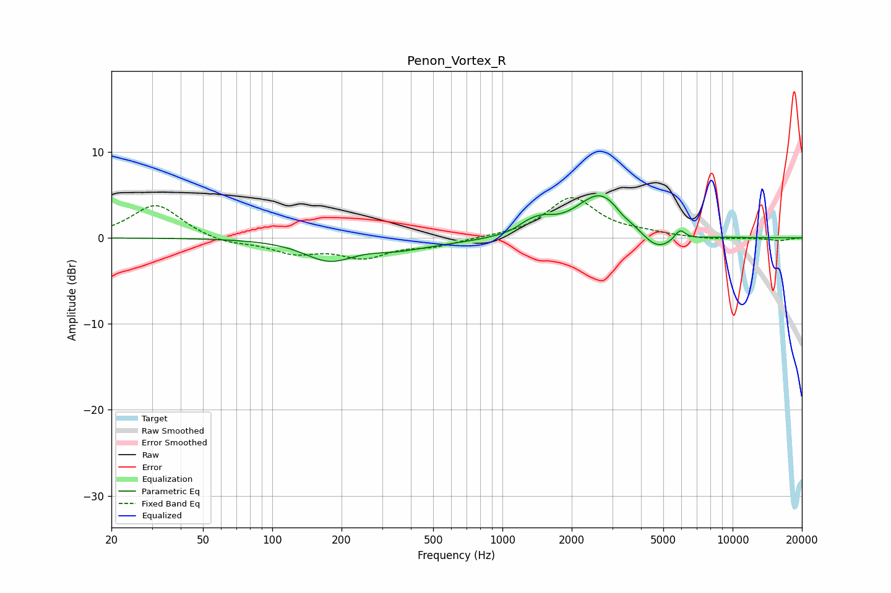

# Penon_Vortex_R
See [usage instructions](https://github.com/jaakkopasanen/AutoEq#usage) for more options and info.

### Parametric EQs
Apply preamp of -5.0 dB when using parametric equalizer.

|   # | Type    |   Fc (Hz) |    Q |   Gain (dB) |
|-----|---------|-----------|------|-------------|
|   1 | Peaking |       148 | 6    |        -0   |
|   2 | Peaking |       177 | 1.3  |        -2.4 |
|   3 | Peaking |       342 | 1.43 |        -0.6 |
|   4 | Peaking |       468 | 0.69 |        -0.7 |
|   5 | Peaking |      1268 | 3.29 |         0.6 |
|   6 | Peaking |      1474 | 2.52 |         1.3 |
|   7 | Peaking |      2682 | 1.31 |         5.3 |
|   8 | Peaking |      3315 | 4.07 |        -0.5 |
|   9 | Peaking |      4672 | 1.9  |        -2.3 |
|  10 | Peaking |      5900 | 6    |         1.2 |

### Fixed Band EQs
When using fixed band (also called graphic) equalizer, apply preamp of **-4.8 dB** (if available) and set gains manually with these parameters.

|   # | Type    |   Fc (Hz) |    Q |   Gain (dB) |
|-----|---------|-----------|------|-------------|
|   1 | Peaking |        31 | 1.41 |         3.9 |
|   2 | Peaking |        62 | 1.41 |        -0.7 |
|   3 | Peaking |       125 | 1.41 |        -1.6 |
|   4 | Peaking |       250 | 1.41 |        -2.1 |
|   5 | Peaking |       500 | 1.41 |        -0.9 |
|   6 | Peaking |      1000 | 1.41 |         0   |
|   7 | Peaking |      2000 | 1.41 |         4.6 |
|   8 | Peaking |      4000 | 1.41 |         0.4 |
|   9 | Peaking |      8000 | 1.41 |        -0.2 |
|  10 | Peaking |     16000 | 1.41 |        -0.3 |

### Graphs

