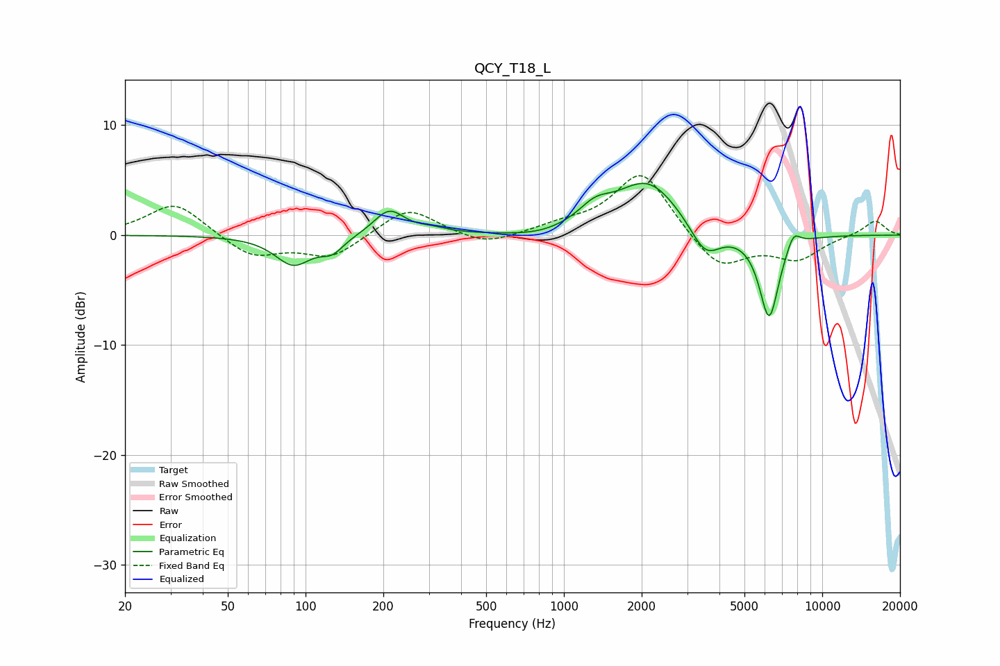

# QCY_T18_L
See [usage instructions](https://github.com/jaakkopasanen/AutoEq#usage) for more options and info.

### Parametric EQs
Apply preamp of -4.8 dB when using parametric equalizer.

|   # | Type    |   Fc (Hz) |    Q |   Gain (dB) |
|-----|---------|-----------|------|-------------|
|   1 | Peaking |        90 | 2    |        -2.7 |
|   2 | Peaking |       127 | 3.16 |        -1.2 |
|   3 | Peaking |       211 | 2.4  |         2.3 |
|   4 | Peaking |       309 | 2.32 |         0.4 |
|   5 | Peaking |       795 | 1.28 |        -0.4 |
|   6 | Peaking |      1319 | 2.2  |         1.5 |
|   7 | Peaking |      2114 | 1.13 |         4.9 |
|   8 | Peaking |      3527 | 2.37 |        -2.9 |
|   9 | Peaking |      6228 | 3.55 |        -7.7 |
|  10 | Peaking |      7736 | 5.08 |         1.5 |

### Fixed Band EQs
When using fixed band (also called graphic) equalizer, apply preamp of **-5.5 dB** (if available) and set gains manually with these parameters.

|   # | Type    |   Fc (Hz) |    Q |   Gain (dB) |
|-----|---------|-----------|------|-------------|
|   1 | Peaking |        31 | 1.41 |         3   |
|   2 | Peaking |        62 | 1.41 |        -2   |
|   3 | Peaking |       125 | 1.41 |        -2   |
|   4 | Peaking |       250 | 1.41 |         2.6 |
|   5 | Peaking |       500 | 1.41 |        -1.1 |
|   6 | Peaking |      1000 | 1.41 |         0.7 |
|   7 | Peaking |      2000 | 1.41 |         5.9 |
|   8 | Peaking |      4000 | 1.41 |        -3.2 |
|   9 | Peaking |      8000 | 1.41 |        -2.1 |
|  10 | Peaking |     16000 | 1.41 |         1.4 |

### Graphs

