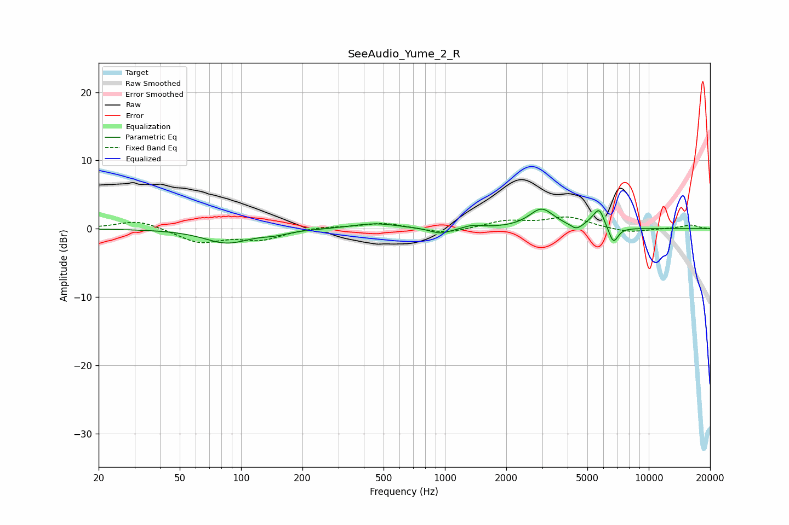

# SeeAudio_Yume_2_R
See [usage instructions](https://github.com/jaakkopasanen/AutoEq#usage) for more options and info.

### Parametric EQs
Apply preamp of -3.0 dB when using parametric equalizer.

|   # | Type    |   Fc (Hz) |    Q |   Gain (dB) |
|-----|---------|-----------|------|-------------|
|   1 | Peaking |        85 | 1.28 |        -2   |
|   2 | Peaking |       147 | 2.1  |        -0.5 |
|   3 | Peaking |       452 | 1.28 |         0.8 |
|   4 | Peaking |       953 | 2.72 |        -0.9 |
|   5 | Peaking |      1375 | 3.29 |         0.4 |
|   6 | Peaking |      2980 | 2.33 |         2.9 |
|   7 | Peaking |      4411 | 5.11 |        -0.8 |
|   8 | Peaking |      5310 | 4.36 |         0.8 |
|   9 | Peaking |      5733 | 5.74 |         2.4 |
|  10 | Peaking |      6712 | 6    |        -2.4 |

### Fixed Band EQs
When using fixed band (also called graphic) equalizer, apply preamp of **-1.8 dB** (if available) and set gains manually with these parameters.

|   # | Type    |   Fc (Hz) |    Q |   Gain (dB) |
|-----|---------|-----------|------|-------------|
|   1 | Peaking |        31 | 1.41 |         1.3 |
|   2 | Peaking |        62 | 1.41 |        -2   |
|   3 | Peaking |       125 | 1.41 |        -1.5 |
|   4 | Peaking |       250 | 1.41 |         0.3 |
|   5 | Peaking |       500 | 1.41 |         0.9 |
|   6 | Peaking |      1000 | 1.41 |        -0.8 |
|   7 | Peaking |      2000 | 1.41 |         1.1 |
|   8 | Peaking |      4000 | 1.41 |         1.6 |
|   9 | Peaking |      8000 | 1.41 |        -0.6 |
|  10 | Peaking |     16000 | 1.41 |         0.6 |

### Graphs

