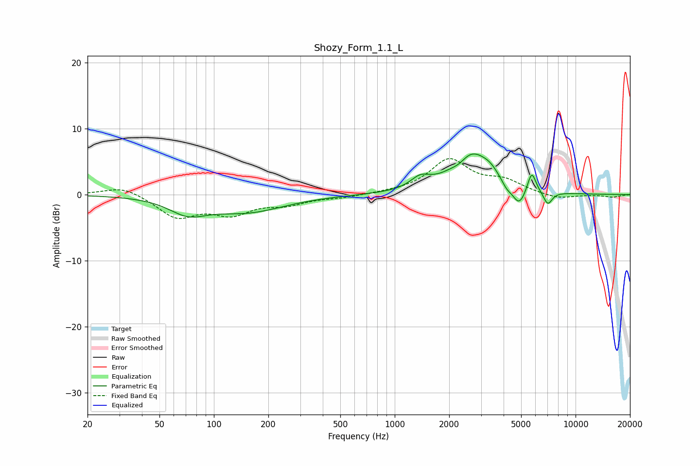

# Shozy_Form_1.1_L
See [usage instructions](https://github.com/jaakkopasanen/AutoEq#usage) for more options and info.

### Parametric EQs
Apply preamp of -6.2 dB when using parametric equalizer.

|   # | Type    |   Fc (Hz) |    Q |   Gain (dB) |
|-----|---------|-----------|------|-------------|
|   1 | Peaking |        72 | 1.38 |        -2.3 |
|   2 | Peaking |       152 | 0.68 |        -2.5 |
|   3 | Peaking |      1384 | 2.62 |         1.6 |
|   4 | Peaking |      2276 | 3.48 |        -0.8 |
|   5 | Peaking |      2669 | 1.27 |         6.3 |
|   6 | Peaking |      3382 | 3.37 |         0.8 |
|   7 | Peaking |      4158 | 5.29 |        -0.9 |
|   8 | Peaking |      4869 | 3.75 |        -3   |
|   9 | Peaking |      5724 | 5.94 |         3.2 |
|  10 | Peaking |      7020 | 5.57 |        -2   |

### Fixed Band EQs
When using fixed band (also called graphic) equalizer, apply preamp of **-5.5 dB** (if available) and set gains manually with these parameters.

|   # | Type    |   Fc (Hz) |    Q |   Gain (dB) |
|-----|---------|-----------|------|-------------|
|   1 | Peaking |        31 | 1.41 |         1.4 |
|   2 | Peaking |        62 | 1.41 |        -3.3 |
|   3 | Peaking |       125 | 1.41 |        -2.6 |
|   4 | Peaking |       250 | 1.41 |        -1.3 |
|   5 | Peaking |       500 | 1.41 |        -0.4 |
|   6 | Peaking |      1000 | 1.41 |         0.2 |
|   7 | Peaking |      2000 | 1.41 |         5.1 |
|   8 | Peaking |      4000 | 1.41 |         1.8 |
|   9 | Peaking |      8000 | 1.41 |        -0.7 |
|  10 | Peaking |     16000 | 1.41 |        -0.4 |

### Graphs

