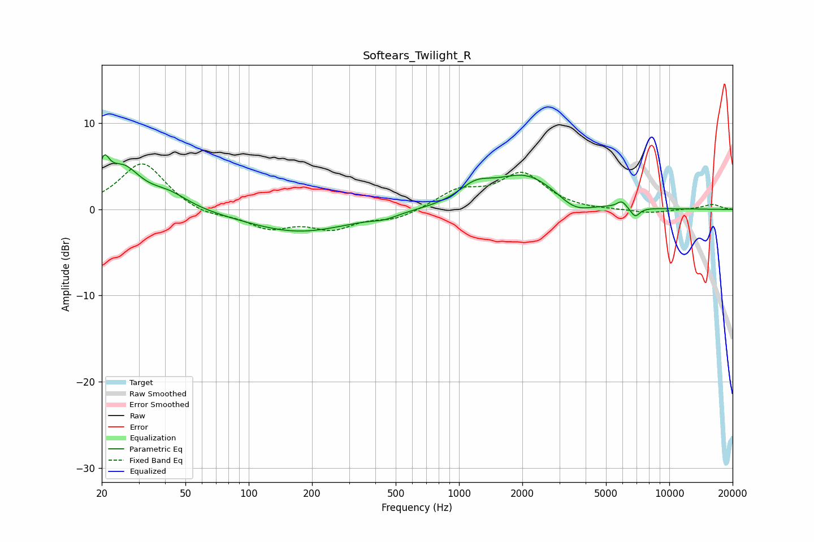

# Softears_Twilight_R
See [usage instructions](https://github.com/jaakkopasanen/AutoEq#usage) for more options and info.

### Parametric EQs
Apply preamp of -6.4 dB when using parametric equalizer.

|   # | Type    |   Fc (Hz) |    Q |   Gain (dB) |
|-----|---------|-----------|------|-------------|
|   1 | Peaking |        20 | 5.8  |         3.1 |
|   2 | Peaking |        25 | 1.68 |         4.5 |
|   3 | Peaking |        42 | 1.51 |         1.5 |
|   4 | Peaking |       173 | 0.56 |        -2.6 |
|   5 | Peaking |       442 | 2.43 |        -0.5 |
|   6 | Peaking |      1198 | 1.76 |         1.9 |
|   7 | Peaking |      2089 | 0.93 |         3.9 |
|   8 | Peaking |      3552 | 1.77 |        -1.5 |
|   9 | Peaking |      5943 | 6    |         0.8 |
|  10 | Peaking |      6879 | 5.98 |        -1.1 |

### Fixed Band EQs
When using fixed band (also called graphic) equalizer, apply preamp of **-5.4 dB** (if available) and set gains manually with these parameters.

|   # | Type    |   Fc (Hz) |    Q |   Gain (dB) |
|-----|---------|-----------|------|-------------|
|   1 | Peaking |        31 | 1.41 |         5.5 |
|   2 | Peaking |        62 | 1.41 |        -0.8 |
|   3 | Peaking |       125 | 1.41 |        -2   |
|   4 | Peaking |       250 | 1.41 |        -2   |
|   5 | Peaking |       500 | 1.41 |        -1.1 |
|   6 | Peaking |      1000 | 1.41 |         2   |
|   7 | Peaking |      2000 | 1.41 |         4   |
|   8 | Peaking |      4000 | 1.41 |        -0.1 |
|   9 | Peaking |      8000 | 1.41 |        -0.5 |
|  10 | Peaking |     16000 | 1.41 |         0.6 |

### Graphs

