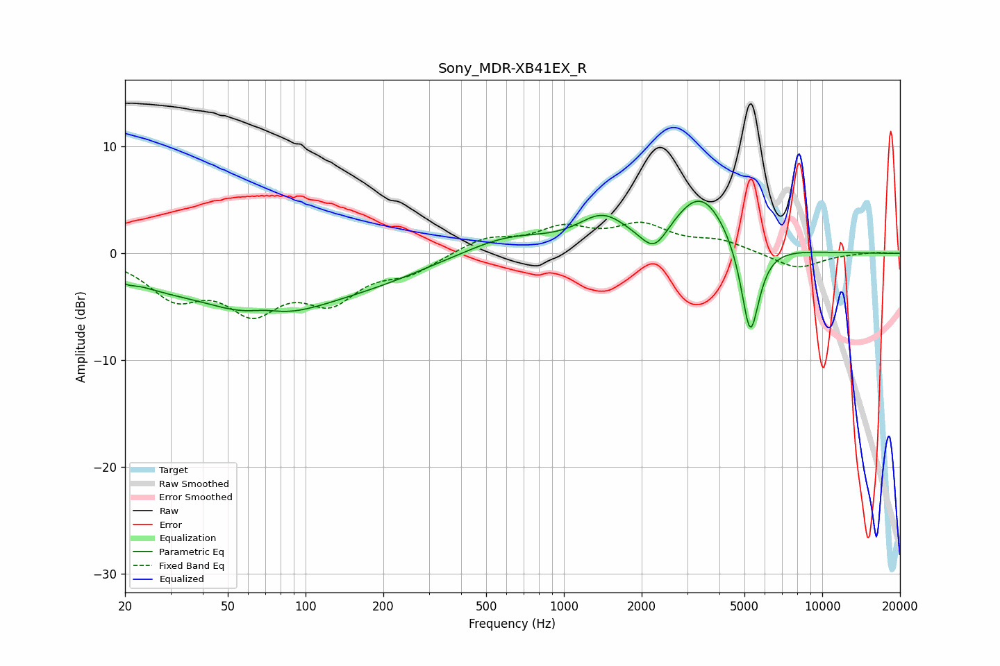

# Sony_MDR-XB41EX_R
See [usage instructions](https://github.com/jaakkopasanen/AutoEq#usage) for more options and info.

### Parametric EQs
Apply preamp of -5.0 dB when using parametric equalizer.

|   # | Type    |   Fc (Hz) |    Q |   Gain (dB) |
|-----|---------|-----------|------|-------------|
|   1 | Peaking |        20 | 4.35 |        -0.5 |
|   2 | Peaking |        26 | 1.01 |        -1.1 |
|   3 | Peaking |        70 | 2.16 |         0.6 |
|   4 | Peaking |        70 | 0.52 |        -5.4 |
|   5 | Peaking |       199 | 0.64 |        -1.2 |
|   6 | Peaking |       606 | 0.84 |         1.7 |
|   7 | Peaking |      1409 | 1.5  |         2.8 |
|   8 | Peaking |      2239 | 2.65 |        -2.4 |
|   9 | Peaking |      3392 | 1.27 |         5.6 |
|  10 | Peaking |      5264 | 3.83 |        -9.2 |

### Fixed Band EQs
When using fixed band (also called graphic) equalizer, apply preamp of **-3.0 dB** (if available) and set gains manually with these parameters.

|   # | Type    |   Fc (Hz) |    Q |   Gain (dB) |
|-----|---------|-----------|------|-------------|
|   1 | Peaking |        31 | 1.41 |        -3.6 |
|   2 | Peaking |        62 | 1.41 |        -4.7 |
|   3 | Peaking |       125 | 1.41 |        -3.9 |
|   4 | Peaking |       250 | 1.41 |        -1.6 |
|   5 | Peaking |       500 | 1.41 |         1.4 |
|   6 | Peaking |      1000 | 1.41 |         2.1 |
|   7 | Peaking |      2000 | 1.41 |         2.4 |
|   8 | Peaking |      4000 | 1.41 |         1   |
|   9 | Peaking |      8000 | 1.41 |        -1.5 |
|  10 | Peaking |     16000 | 1.41 |         0.1 |

### Graphs

