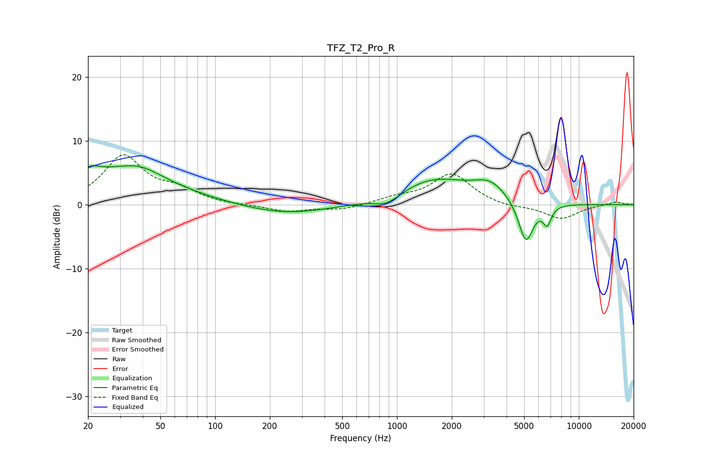

# TFZ_T2_Pro_R
See [usage instructions](https://github.com/jaakkopasanen/AutoEq#usage) for more options and info.

### Parametric EQs
Apply preamp of -6.2 dB when using parametric equalizer.

|   # | Type    |   Fc (Hz) |    Q |   Gain (dB) |
|-----|---------|-----------|------|-------------|
|   1 | Peaking |        22 | 5.54 |         3.4 |
|   2 | Peaking |        22 | 5.93 |        -2.8 |
|   3 | Peaking |        22 | 0.35 |         5   |
|   4 | Peaking |        39 | 1.21 |         1.8 |
|   5 | Peaking |       245 | 0.58 |        -1.6 |
|   6 | Peaking |       882 | 1.99 |        -1.5 |
|   7 | Peaking |      1598 | 0.72 |         3.9 |
|   8 | Peaking |      3266 | 1.5  |         2.6 |
|   9 | Peaking |      5115 | 3.36 |        -6.7 |
|  10 | Peaking |      6698 | 6    |        -2.8 |

### Fixed Band EQs
When using fixed band (also called graphic) equalizer, apply preamp of **-7.9 dB** (if available) and set gains manually with these parameters.

|   # | Type    |   Fc (Hz) |    Q |   Gain (dB) |
|-----|---------|-----------|------|-------------|
|   1 | Peaking |        31 | 1.41 |         7.5 |
|   2 | Peaking |        62 | 1.41 |         1.9 |
|   3 | Peaking |       125 | 1.41 |        -0.1 |
|   4 | Peaking |       250 | 1.41 |        -1.1 |
|   5 | Peaking |       500 | 1.41 |        -0.8 |
|   6 | Peaking |      1000 | 1.41 |         0.9 |
|   7 | Peaking |      2000 | 1.41 |         4.8 |
|   8 | Peaking |      4000 | 1.41 |        -0.5 |
|   9 | Peaking |      8000 | 1.41 |        -2.2 |
|  10 | Peaking |     16000 | 1.41 |         0.5 |

### Graphs

