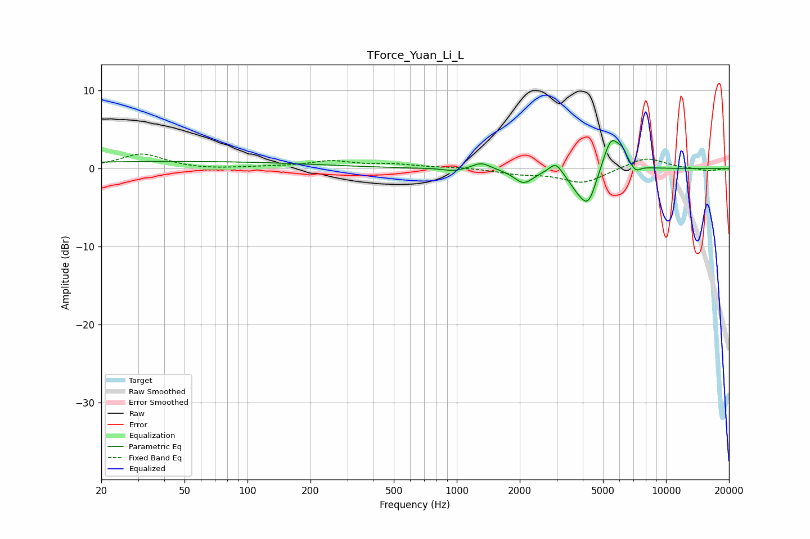

# TForce_Yuan_Li_L
See [usage instructions](https://github.com/jaakkopasanen/AutoEq#usage) for more options and info.

### Parametric EQs
Apply preamp of -3.7 dB when using parametric equalizer.

|   # | Type    |   Fc (Hz) |    Q |   Gain (dB) |
|-----|---------|-----------|------|-------------|
|   1 | Peaking |        43 | 0.18 |         0.9 |
|   2 | Peaking |       965 | 3.2  |        -0.4 |
|   3 | Peaking |      1313 | 3.38 |         0.9 |
|   4 | Peaking |      2090 | 3.04 |        -1.8 |
|   5 | Peaking |      2973 | 4.63 |         1.4 |
|   6 | Peaking |      3737 | 3.2  |        -1.5 |
|   7 | Peaking |      4253 | 3.46 |        -4.2 |
|   8 | Peaking |      5475 | 3.41 |         4.3 |
|   9 | Peaking |      6208 | 5.99 |         1.2 |
|  10 | Peaking |      7157 | 6    |        -0.9 |

### Fixed Band EQs
When using fixed band (also called graphic) equalizer, apply preamp of **-2.0 dB** (if available) and set gains manually with these parameters.

|   # | Type    |   Fc (Hz) |    Q |   Gain (dB) |
|-----|---------|-----------|------|-------------|
|   1 | Peaking |        31 | 1.41 |         1.9 |
|   2 | Peaking |        62 | 1.41 |        -0.2 |
|   3 | Peaking |       125 | 1.41 |         0.2 |
|   4 | Peaking |       250 | 1.41 |         0.9 |
|   5 | Peaking |       500 | 1.41 |         0.5 |
|   6 | Peaking |      1000 | 1.41 |         0.2 |
|   7 | Peaking |      2000 | 1.41 |        -0.6 |
|   8 | Peaking |      4000 | 1.41 |        -1.9 |
|   9 | Peaking |      8000 | 1.41 |         1.5 |
|  10 | Peaking |     16000 | 1.41 |        -0.3 |

### Graphs

