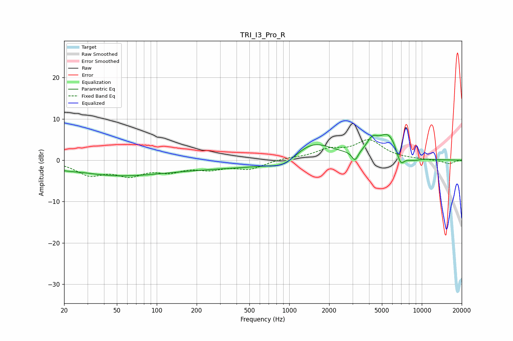

# TRI_I3_Pro_R
See [usage instructions](https://github.com/jaakkopasanen/AutoEq#usage) for more options and info.

### Parametric EQs
Apply preamp of -6.3 dB when using parametric equalizer.

|   # | Type    |   Fc (Hz) |    Q |   Gain (dB) |
|-----|---------|-----------|------|-------------|
|   1 | Peaking |        28 | 1.22 |         0.4 |
|   2 | Peaking |        44 | 0.33 |        -3.7 |
|   3 | Peaking |       429 | 0.31 |        -1.7 |
|   4 | Peaking |       921 | 1.4  |        -2.1 |
|   5 | Peaking |      1486 | 0.92 |         5   |
|   6 | Peaking |      3131 | 6    |        -2.4 |
|   7 | Peaking |      4226 | 3.4  |         2.9 |
|   8 | Peaking |      5598 | 1.81 |         6   |
|   9 | Peaking |      6909 | 4.41 |        -3.7 |
|  10 | Peaking |      8373 | 2.32 |        -1.1 |

### Fixed Band EQs
When using fixed band (also called graphic) equalizer, apply preamp of **-5.1 dB** (if available) and set gains manually with these parameters.

|   # | Type    |   Fc (Hz) |    Q |   Gain (dB) |
|-----|---------|-----------|------|-------------|
|   1 | Peaking |        31 | 1.41 |        -3.3 |
|   2 | Peaking |        62 | 1.41 |        -3.1 |
|   3 | Peaking |       125 | 1.41 |        -2.2 |
|   4 | Peaking |       250 | 1.41 |        -1.8 |
|   5 | Peaking |       500 | 1.41 |        -2   |
|   6 | Peaking |      1000 | 1.41 |         0.5 |
|   7 | Peaking |      2000 | 1.41 |         2.2 |
|   8 | Peaking |      4000 | 1.41 |         4.6 |
|   9 | Peaking |      8000 | 1.41 |         0.1 |
|  10 | Peaking |     16000 | 1.41 |        -0.9 |

### Graphs

