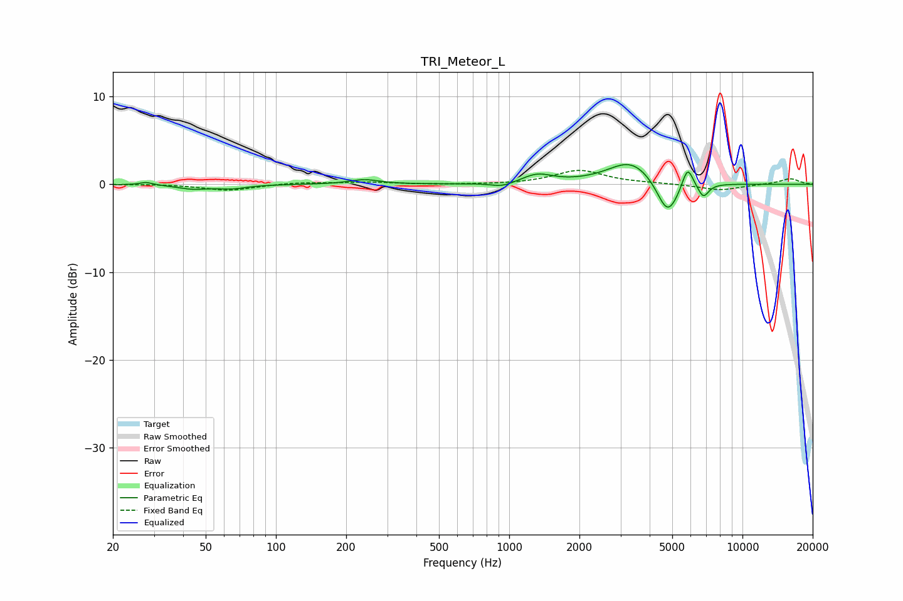

# TRI_Meteor_L
See [usage instructions](https://github.com/jaakkopasanen/AutoEq#usage) for more options and info.

### Parametric EQs
Apply preamp of -2.3 dB when using parametric equalizer.

|   # | Type    |   Fc (Hz) |    Q |   Gain (dB) |
|-----|---------|-----------|------|-------------|
|   1 | Peaking |        28 | 5.42 |         0.3 |
|   2 | Peaking |        44 | 2.18 |        -0.5 |
|   3 | Peaking |        65 | 2.21 |        -0.4 |
|   4 | Peaking |       239 | 2.2  |         0.5 |
|   5 | Peaking |       933 | 2.92 |        -0.5 |
|   6 | Peaking |      1320 | 2.19 |         1   |
|   7 | Peaking |      3344 | 1.41 |         2.8 |
|   8 | Peaking |      4776 | 2.98 |        -4.1 |
|   9 | Peaking |      5815 | 5.95 |         2.6 |
|  10 | Peaking |      6793 | 5.95 |        -1.6 |

### Fixed Band EQs
When using fixed band (also called graphic) equalizer, apply preamp of **-1.7 dB** (if available) and set gains manually with these parameters.

|   # | Type    |   Fc (Hz) |    Q |   Gain (dB) |
|-----|---------|-----------|------|-------------|
|   1 | Peaking |        31 | 1.41 |         0   |
|   2 | Peaking |        62 | 1.41 |        -0.7 |
|   3 | Peaking |       125 | 1.41 |         0.2 |
|   4 | Peaking |       250 | 1.41 |         0.2 |
|   5 | Peaking |       500 | 1.41 |        -0   |
|   6 | Peaking |      1000 | 1.41 |        -0   |
|   7 | Peaking |      2000 | 1.41 |         1.6 |
|   8 | Peaking |      4000 | 1.41 |         0.1 |
|   9 | Peaking |      8000 | 1.41 |        -0.7 |
|  10 | Peaking |     16000 | 1.41 |         0.7 |

### Graphs

