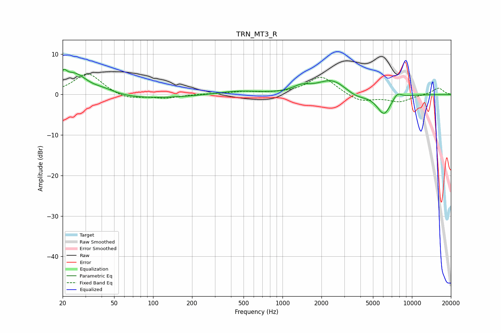

# TRN_MT3_R
See [usage instructions](https://github.com/jaakkopasanen/AutoEq#usage) for more options and info.

### Parametric EQs
Apply preamp of -6.3 dB when using parametric equalizer.

|   # | Type    |   Fc (Hz) |    Q |   Gain (dB) |
|-----|---------|-----------|------|-------------|
|   1 | Peaking |        20 | 5.86 |         2.4 |
|   2 | Peaking |        25 | 1.42 |         5.3 |
|   3 | Peaking |        42 | 1.52 |         1.1 |
|   4 | Peaking |        69 | 0.37 |        -1.1 |
|   5 | Peaking |       450 | 0.92 |         0.9 |
|   6 | Peaking |      1399 | 2.12 |         1.4 |
|   7 | Peaking |      2416 | 1.24 |         3.7 |
|   8 | Peaking |      3689 | 1.71 |        -1.4 |
|   9 | Peaking |      6087 | 2.52 |        -5   |
|  10 | Peaking |      7689 | 4.02 |         1.5 |

### Fixed Band EQs
When using fixed band (also called graphic) equalizer, apply preamp of **-5.1 dB** (if available) and set gains manually with these parameters.

|   # | Type    |   Fc (Hz) |    Q |   Gain (dB) |
|-----|---------|-----------|------|-------------|
|   1 | Peaking |        31 | 1.41 |         5.3 |
|   2 | Peaking |        62 | 1.41 |        -1.3 |
|   3 | Peaking |       125 | 1.41 |        -0.9 |
|   4 | Peaking |       250 | 1.41 |         0.1 |
|   5 | Peaking |       500 | 1.41 |         0.6 |
|   6 | Peaking |      1000 | 1.41 |         0.1 |
|   7 | Peaking |      2000 | 1.41 |         4.5 |
|   8 | Peaking |      4000 | 1.41 |        -1.9 |
|   9 | Peaking |      8000 | 1.41 |        -1.7 |
|  10 | Peaking |     16000 | 1.41 |         1.7 |

### Graphs

