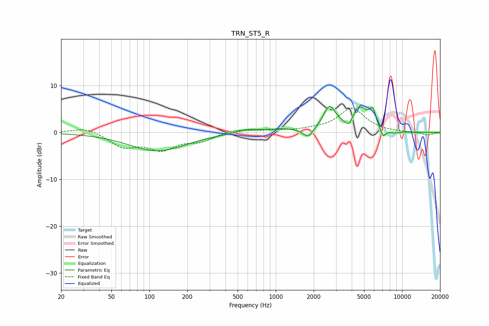

# TRN_ST5_R
See [usage instructions](https://github.com/jaakkopasanen/AutoEq#usage) for more options and info.

### Parametric EQs
Apply preamp of -5.7 dB when using parametric equalizer.

|   # | Type    |   Fc (Hz) |    Q |   Gain (dB) |
|-----|---------|-----------|------|-------------|
|   1 | Peaking |       116 | 0.64 |        -3.9 |
|   2 | Peaking |       585 | 1.86 |         0.7 |
|   3 | Peaking |      1091 | 0.96 |         0.7 |
|   4 | Peaking |      1805 | 3.63 |        -2   |
|   5 | Peaking |      2662 | 2.93 |         4.9 |
|   6 | Peaking |      3818 | 4.08 |        -2.5 |
|   7 | Peaking |      4548 | 1.92 |         5.5 |
|   8 | Peaking |      5868 | 5.66 |         3   |
|   9 | Peaking |      7063 | 5.93 |        -2   |
|  10 | Peaking |      8593 | 2.64 |        -0.6 |

### Fixed Band EQs
When using fixed band (also called graphic) equalizer, apply preamp of **-5.3 dB** (if available) and set gains manually with these parameters.

|   # | Type    |   Fc (Hz) |    Q |   Gain (dB) |
|-----|---------|-----------|------|-------------|
|   1 | Peaking |        31 | 1.41 |         1.2 |
|   2 | Peaking |        62 | 1.41 |        -2.9 |
|   3 | Peaking |       125 | 1.41 |        -3.3 |
|   4 | Peaking |       250 | 1.41 |        -1.6 |
|   5 | Peaking |       500 | 1.41 |         0.8 |
|   6 | Peaking |      1000 | 1.41 |         0.3 |
|   7 | Peaking |      2000 | 1.41 |         0.5 |
|   8 | Peaking |      4000 | 1.41 |         5.1 |
|   9 | Peaking |      8000 | 1.41 |         0   |
|  10 | Peaking |     16000 | 1.41 |        -0.6 |

### Graphs

