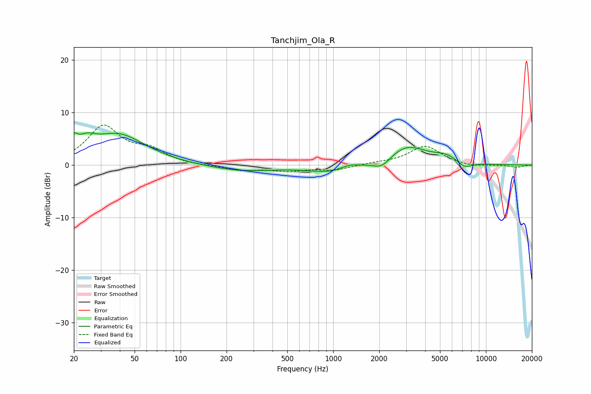

# Tanchjim_Ola_R
See [usage instructions](https://github.com/jaakkopasanen/AutoEq#usage) for more options and info.

### Parametric EQs
Apply preamp of -6.2 dB when using parametric equalizer.

|   # | Type    |   Fc (Hz) |    Q |   Gain (dB) |
|-----|---------|-----------|------|-------------|
|   1 | Peaking |        20 | 5.79 |         2.3 |
|   2 | Peaking |        24 | 2.5  |         2.2 |
|   3 | Peaking |        39 | 0.78 |         5.7 |
|   4 | Peaking |       252 | 0.65 |        -1.1 |
|   5 | Peaking |      1026 | 0.96 |        -1.7 |
|   6 | Peaking |      1252 | 1.97 |         1.1 |
|   7 | Peaking |      2083 | 2.42 |        -1.8 |
|   8 | Peaking |      3021 | 1.12 |         3.7 |
|   9 | Peaking |      5493 | 1.63 |         1.4 |
|  10 | Peaking |      7226 | 2.76 |        -1.3 |

### Fixed Band EQs
When using fixed band (also called graphic) equalizer, apply preamp of **-7.7 dB** (if available) and set gains manually with these parameters.

|   # | Type    |   Fc (Hz) |    Q |   Gain (dB) |
|-----|---------|-----------|------|-------------|
|   1 | Peaking |        31 | 1.41 |         7.2 |
|   2 | Peaking |        62 | 1.41 |         2.4 |
|   3 | Peaking |       125 | 1.41 |        -0.1 |
|   4 | Peaking |       250 | 1.41 |        -1   |
|   5 | Peaking |       500 | 1.41 |        -1   |
|   6 | Peaking |      1000 | 1.41 |        -0.9 |
|   7 | Peaking |      2000 | 1.41 |         0.3 |
|   8 | Peaking |      4000 | 1.41 |         3.6 |
|   9 | Peaking |      8000 | 1.41 |        -0.4 |
|  10 | Peaking |     16000 | 1.41 |        -0.4 |

### Graphs

