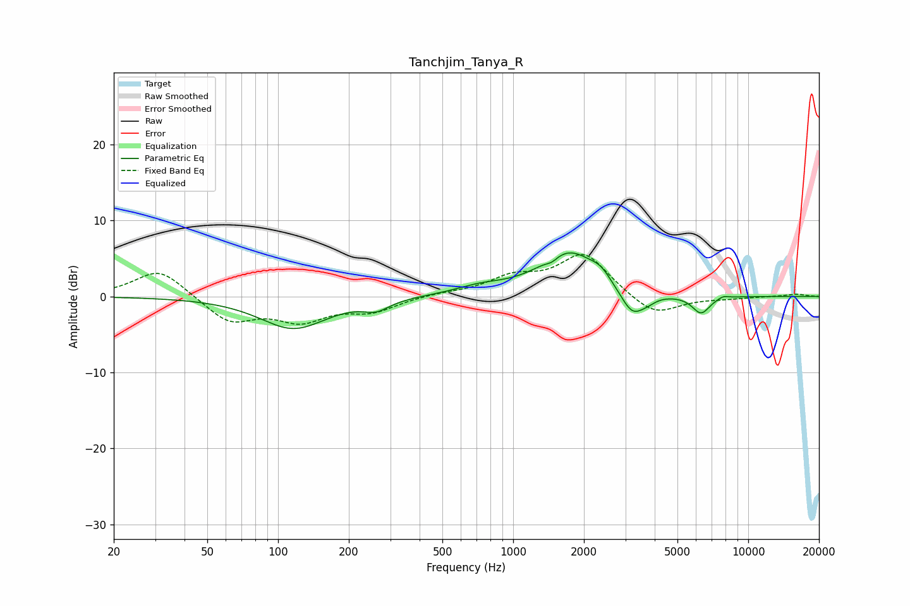

# Tanchjim_Tanya_R
See [usage instructions](https://github.com/jaakkopasanen/AutoEq#usage) for more options and info.

### Parametric EQs
Apply preamp of -5.8 dB when using parametric equalizer.

|   # | Type    |   Fc (Hz) |    Q |   Gain (dB) |
|-----|---------|-----------|------|-------------|
|   1 | Peaking |       116 | 0.99 |        -4.2 |
|   2 | Peaking |       262 | 2.63 |        -1.2 |
|   3 | Peaking |       723 | 1.29 |         1   |
|   4 | Peaking |      1462 | 5.64 |        -0.6 |
|   5 | Peaking |      1732 | 1.14 |         5.8 |
|   6 | Peaking |      2363 | 3.41 |         1.1 |
|   7 | Peaking |      3221 | 2.62 |        -3.7 |
|   8 | Peaking |      3769 | 4.65 |        -0.4 |
|   9 | Peaking |      6297 | 3.62 |        -2.3 |
|  10 | Peaking |      7828 | 5.97 |         0.4 |

### Fixed Band EQs
When using fixed band (also called graphic) equalizer, apply preamp of **-5.6 dB** (if available) and set gains manually with these parameters.

|   # | Type    |   Fc (Hz) |    Q |   Gain (dB) |
|-----|---------|-----------|------|-------------|
|   1 | Peaking |        31 | 1.41 |         3.7 |
|   2 | Peaking |        62 | 1.41 |        -3.4 |
|   3 | Peaking |       125 | 1.41 |        -2.9 |
|   4 | Peaking |       250 | 1.41 |        -1.8 |
|   5 | Peaking |       500 | 1.41 |         0.4 |
|   6 | Peaking |      1000 | 1.41 |         2.2 |
|   7 | Peaking |      2000 | 1.41 |         5.6 |
|   8 | Peaking |      4000 | 1.41 |        -2.8 |
|   9 | Peaking |      8000 | 1.41 |        -0.2 |
|  10 | Peaking |     16000 | 1.41 |         0.3 |

### Graphs

