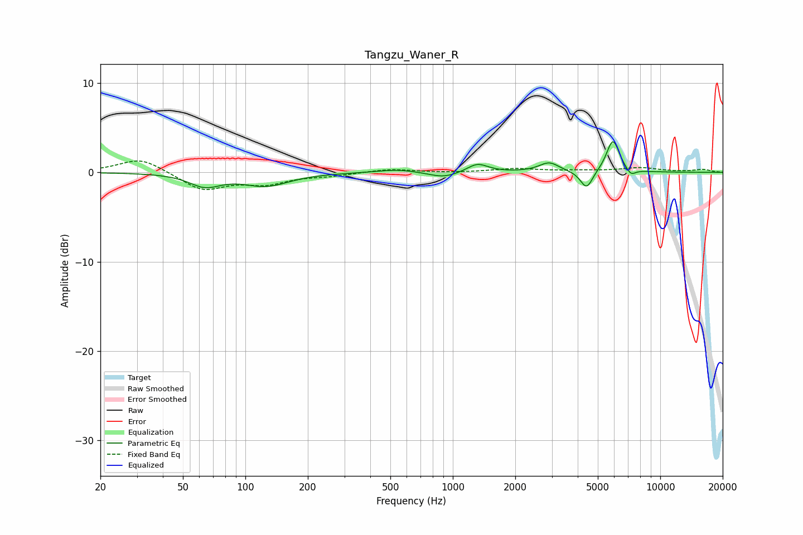

# Tangzu_Waner_R
See [usage instructions](https://github.com/jaakkopasanen/AutoEq#usage) for more options and info.

### Parametric EQs
Apply preamp of -3.5 dB when using parametric equalizer.

|   # | Type    |   Fc (Hz) |    Q |   Gain (dB) |
|-----|---------|-----------|------|-------------|
|   1 | Peaking |        64 | 1.89 |        -1.4 |
|   2 | Peaking |       126 | 1.28 |        -1.4 |
|   3 | Peaking |       532 | 1.58 |         0.3 |
|   4 | Peaking |       644 | 1.31 |         0   |
|   5 | Peaking |       904 | 1.98 |        -0.7 |
|   6 | Peaking |      1315 | 2.82 |         1   |
|   7 | Peaking |      2913 | 2.93 |         1.1 |
|   8 | Peaking |      4415 | 4.73 |        -2.1 |
|   9 | Peaking |      5917 | 4.38 |         3.7 |
|  10 | Peaking |      7212 | 5.99 |        -0.8 |

### Fixed Band EQs
When using fixed band (also called graphic) equalizer, apply preamp of **-1.4 dB** (if available) and set gains manually with these parameters.

|   # | Type    |   Fc (Hz) |    Q |   Gain (dB) |
|-----|---------|-----------|------|-------------|
|   1 | Peaking |        31 | 1.41 |         1.7 |
|   2 | Peaking |        62 | 1.41 |        -2   |
|   3 | Peaking |       125 | 1.41 |        -1.1 |
|   4 | Peaking |       250 | 1.41 |        -0.3 |
|   5 | Peaking |       500 | 1.41 |         0.4 |
|   6 | Peaking |      1000 | 1.41 |        -0   |
|   7 | Peaking |      2000 | 1.41 |         0.4 |
|   8 | Peaking |      4000 | 1.41 |         0.1 |
|   9 | Peaking |      8000 | 1.41 |         0.5 |
|  10 | Peaking |     16000 | 1.41 |         0.3 |

### Graphs

