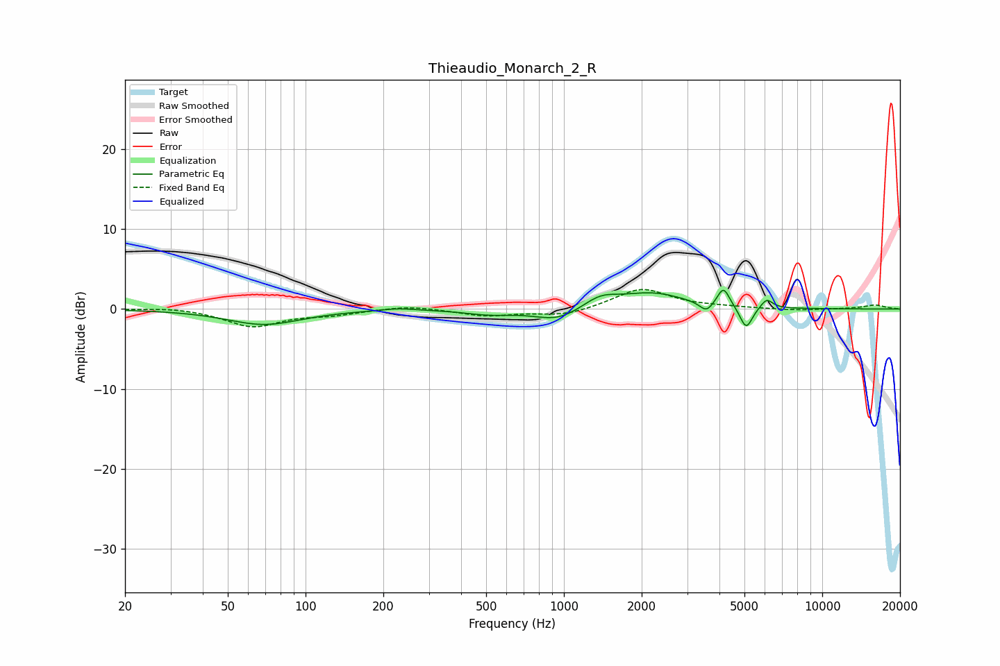

# Thieaudio_Monarch_2_R
See [usage instructions](https://github.com/jaakkopasanen/AutoEq#usage) for more options and info.

### Parametric EQs
Apply preamp of -2.5 dB when using parametric equalizer.

|   # | Type    |   Fc (Hz) |    Q |   Gain (dB) |
|-----|---------|-----------|------|-------------|
|   1 | Peaking |        69 | 0.99 |        -1.9 |
|   2 | Peaking |       229 | 2.19 |         0.3 |
|   3 | Peaking |       512 | 1.53 |        -0.6 |
|   4 | Peaking |       951 | 1.53 |        -1.6 |
|   5 | Peaking |      1383 | 2.07 |         1.4 |
|   6 | Peaking |      2198 | 1.1  |         1.9 |
|   7 | Peaking |      3560 | 5.49 |        -1.2 |
|   8 | Peaking |      4146 | 6    |         2.4 |
|   9 | Peaking |      5077 | 5.84 |        -2.8 |
|  10 | Peaking |      6094 | 6    |         1.2 |

### Fixed Band EQs
When using fixed band (also called graphic) equalizer, apply preamp of **-2.5 dB** (if available) and set gains manually with these parameters.

|   # | Type    |   Fc (Hz) |    Q |   Gain (dB) |
|-----|---------|-----------|------|-------------|
|   1 | Peaking |        31 | 1.41 |         0.3 |
|   2 | Peaking |        62 | 1.41 |        -2.2 |
|   3 | Peaking |       125 | 1.41 |        -0.6 |
|   4 | Peaking |       250 | 1.41 |         0.5 |
|   5 | Peaking |       500 | 1.41 |        -0.8 |
|   6 | Peaking |      1000 | 1.41 |        -0.9 |
|   7 | Peaking |      2000 | 1.41 |         2.6 |
|   8 | Peaking |      4000 | 1.41 |         0.2 |
|   9 | Peaking |      8000 | 1.41 |        -0.2 |
|  10 | Peaking |     16000 | 1.41 |         0.5 |

### Graphs

