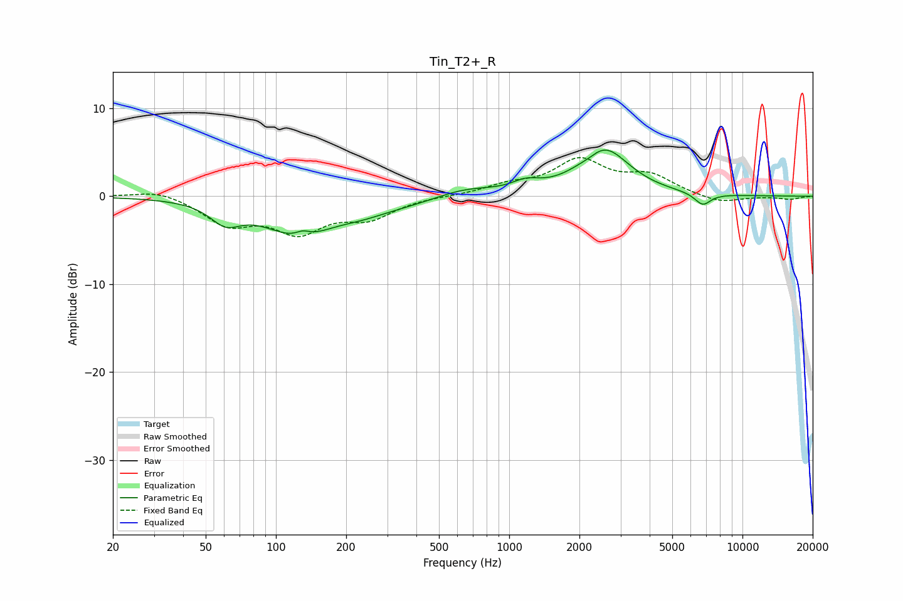

# Tin_T2+_R
See [usage instructions](https://github.com/jaakkopasanen/AutoEq#usage) for more options and info.

### Parametric EQs
Apply preamp of -5.4 dB when using parametric equalizer.

|   # | Type    |   Fc (Hz) |    Q |   Gain (dB) |
|-----|---------|-----------|------|-------------|
|   1 | Peaking |        61 | 2.19 |        -2.2 |
|   2 | Peaking |       125 | 0.95 |        -4.2 |
|   3 | Peaking |       130 | 4.52 |         0.7 |
|   4 | Peaking |       232 | 1.39 |        -0.8 |
|   5 | Peaking |       337 | 0.93 |        -0.7 |
|   6 | Peaking |       651 | 1.11 |         0.9 |
|   7 | Peaking |      1180 | 2.4  |         1   |
|   8 | Peaking |      2225 | 2.97 |        -0.5 |
|   9 | Peaking |      2535 | 1.31 |         5.5 |
|  10 | Peaking |      6754 | 3.89 |        -1.4 |

### Fixed Band EQs
When using fixed band (also called graphic) equalizer, apply preamp of **-4.5 dB** (if available) and set gains manually with these parameters.

|   # | Type    |   Fc (Hz) |    Q |   Gain (dB) |
|-----|---------|-----------|------|-------------|
|   1 | Peaking |        31 | 1.41 |         0.8 |
|   2 | Peaking |        62 | 1.41 |        -3   |
|   3 | Peaking |       125 | 1.41 |        -3.7 |
|   4 | Peaking |       250 | 1.41 |        -2.2 |
|   5 | Peaking |       500 | 1.41 |         0   |
|   6 | Peaking |      1000 | 1.41 |         1.1 |
|   7 | Peaking |      2000 | 1.41 |         3.9 |
|   8 | Peaking |      4000 | 1.41 |         2.1 |
|   9 | Peaking |      8000 | 1.41 |        -0.8 |
|  10 | Peaking |     16000 | 1.41 |        -0.3 |

### Graphs

