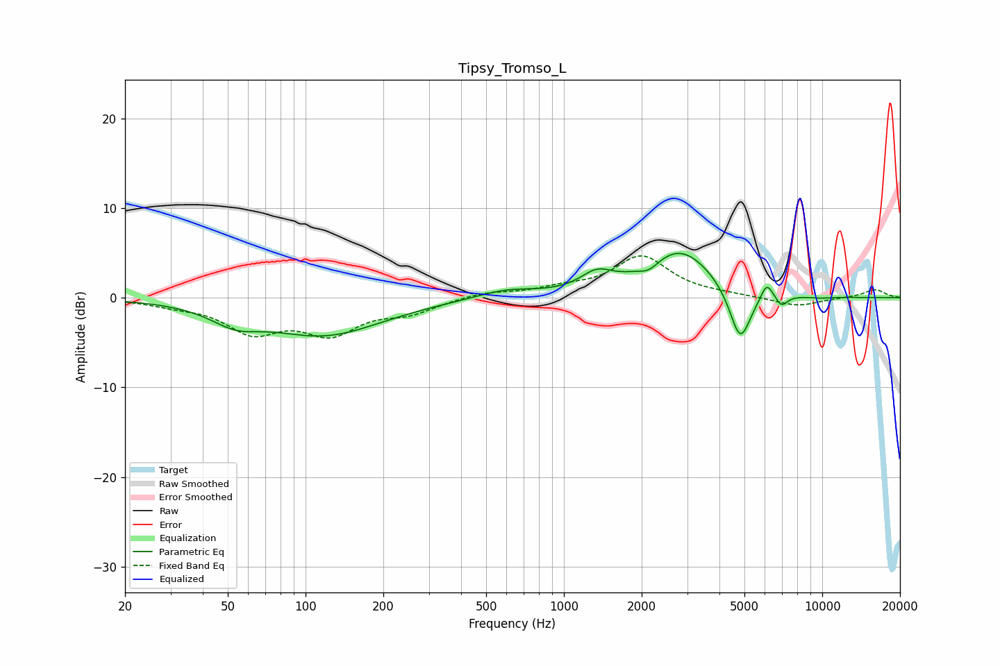

# Tipsy_Tromso_L
See [usage instructions](https://github.com/jaakkopasanen/AutoEq#usage) for more options and info.

### Parametric EQs
Apply preamp of -5.0 dB when using parametric equalizer.

|   # | Type    |   Fc (Hz) |    Q |   Gain (dB) |
|-----|---------|-----------|------|-------------|
|   1 | Peaking |        53 | 1.5  |        -1.8 |
|   2 | Peaking |       118 | 0.62 |        -4.1 |
|   3 | Peaking |       597 | 1.23 |         0.9 |
|   4 | Peaking |      1339 | 2.3  |         1.8 |
|   5 | Peaking |      2137 | 3.66 |        -0.9 |
|   6 | Peaking |      2810 | 1.06 |         5.4 |
|   7 | Peaking |      4815 | 3.32 |        -6.2 |
|   8 | Peaking |      6099 | 6    |         1.9 |
|   9 | Peaking |      6960 | 6    |        -1.2 |
|  10 | Peaking |      9701 | 2    |        -0.2 |

### Fixed Band EQs
When using fixed band (also called graphic) equalizer, apply preamp of **-4.8 dB** (if available) and set gains manually with these parameters.

|   # | Type    |   Fc (Hz) |    Q |   Gain (dB) |
|-----|---------|-----------|------|-------------|
|   1 | Peaking |        31 | 1.41 |        -0.6 |
|   2 | Peaking |        62 | 1.41 |        -3.5 |
|   3 | Peaking |       125 | 1.41 |        -3.6 |
|   4 | Peaking |       250 | 1.41 |        -1.5 |
|   5 | Peaking |       500 | 1.41 |         0.6 |
|   6 | Peaking |      1000 | 1.41 |         0.8 |
|   7 | Peaking |      2000 | 1.41 |         4.5 |
|   8 | Peaking |      4000 | 1.41 |         0.2 |
|   9 | Peaking |      8000 | 1.41 |        -1   |
|  10 | Peaking |     16000 | 1.41 |         0.9 |

### Graphs

