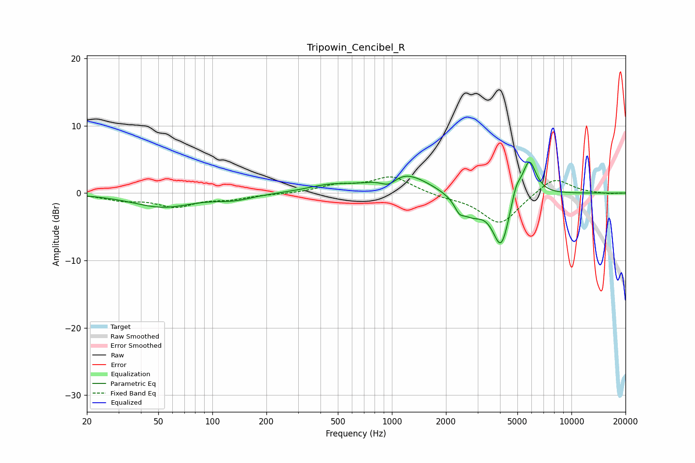

# Tripowin_Cencibel_R
See [usage instructions](https://github.com/jaakkopasanen/AutoEq#usage) for more options and info.

### Parametric EQs
Apply preamp of -4.7 dB when using parametric equalizer.

|   # | Type    |   Fc (Hz) |    Q |   Gain (dB) |
|-----|---------|-----------|------|-------------|
|   1 | Peaking |        53 | 0.84 |        -2   |
|   2 | Peaking |       132 | 1.38 |        -0.8 |
|   3 | Peaking |       448 | 1.13 |         1   |
|   4 | Peaking |       962 | 3.06 |        -1.5 |
|   5 | Peaking |      1147 | 1.04 |         3.2 |
|   6 | Peaking |      2371 | 5.68 |        -1.3 |
|   7 | Peaking |      2755 | 1.98 |        -2.9 |
|   8 | Peaking |      4059 | 2.92 |        -7.8 |
|   9 | Peaking |      4914 | 5.08 |         2.4 |
|  10 | Peaking |      5818 | 3.52 |         5.5 |

### Fixed Band EQs
When using fixed band (also called graphic) equalizer, apply preamp of **-2.5 dB** (if available) and set gains manually with these parameters.

|   # | Type    |   Fc (Hz) |    Q |   Gain (dB) |
|-----|---------|-----------|------|-------------|
|   1 | Peaking |        31 | 1.41 |        -0.9 |
|   2 | Peaking |        62 | 1.41 |        -1.9 |
|   3 | Peaking |       125 | 1.41 |        -0.7 |
|   4 | Peaking |       250 | 1.41 |        -0.1 |
|   5 | Peaking |       500 | 1.41 |         1.1 |
|   6 | Peaking |      1000 | 1.41 |         2.4 |
|   7 | Peaking |      2000 | 1.41 |        -0.5 |
|   8 | Peaking |      4000 | 1.41 |        -4.7 |
|   9 | Peaking |      8000 | 1.41 |         2.5 |
|  10 | Peaking |     16000 | 1.41 |        -0.1 |

### Graphs

