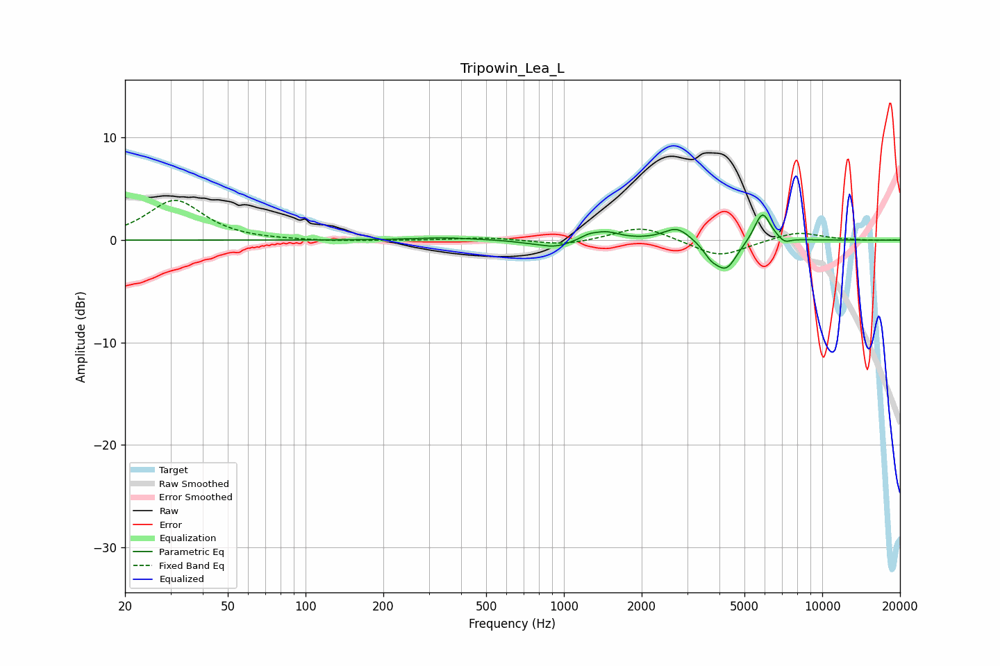

# Tripowin_Lea_L
See [usage instructions](https://github.com/jaakkopasanen/AutoEq#usage) for more options and info.

### Parametric EQs
Apply preamp of -2.6 dB when using parametric equalizer.

|   # | Type    |   Fc (Hz) |    Q |   Gain (dB) |
|-----|---------|-----------|------|-------------|
|   1 | Peaking |       341 | 1.24 |         0.2 |
|   2 | Peaking |       734 | 2.32 |        -0.1 |
|   3 | Peaking |       926 | 2.29 |        -0.7 |
|   4 | Peaking |      1247 | 4.58 |         0.3 |
|   5 | Peaking |      1453 | 2.69 |         0.8 |
|   6 | Peaking |      2737 | 2.77 |         1.3 |
|   7 | Peaking |      3699 | 4.71 |        -1   |
|   8 | Peaking |      4242 | 3.19 |        -2.8 |
|   9 | Peaking |      5867 | 4.41 |         2.9 |
|  10 | Peaking |      7149 | 6    |        -0.5 |

### Fixed Band EQs
When using fixed band (also called graphic) equalizer, apply preamp of **-4.0 dB** (if available) and set gains manually with these parameters.

|   # | Type    |   Fc (Hz) |    Q |   Gain (dB) |
|-----|---------|-----------|------|-------------|
|   1 | Peaking |        31 | 1.41 |         3.9 |
|   2 | Peaking |        62 | 1.41 |        -0.1 |
|   3 | Peaking |       125 | 1.41 |        -0.1 |
|   4 | Peaking |       250 | 1.41 |        -0   |
|   5 | Peaking |       500 | 1.41 |         0.3 |
|   6 | Peaking |      1000 | 1.41 |        -0.5 |
|   7 | Peaking |      2000 | 1.41 |         1.4 |
|   8 | Peaking |      4000 | 1.41 |        -1.7 |
|   9 | Peaking |      8000 | 1.41 |         0.9 |
|  10 | Peaking |     16000 | 1.41 |        -0   |

### Graphs

