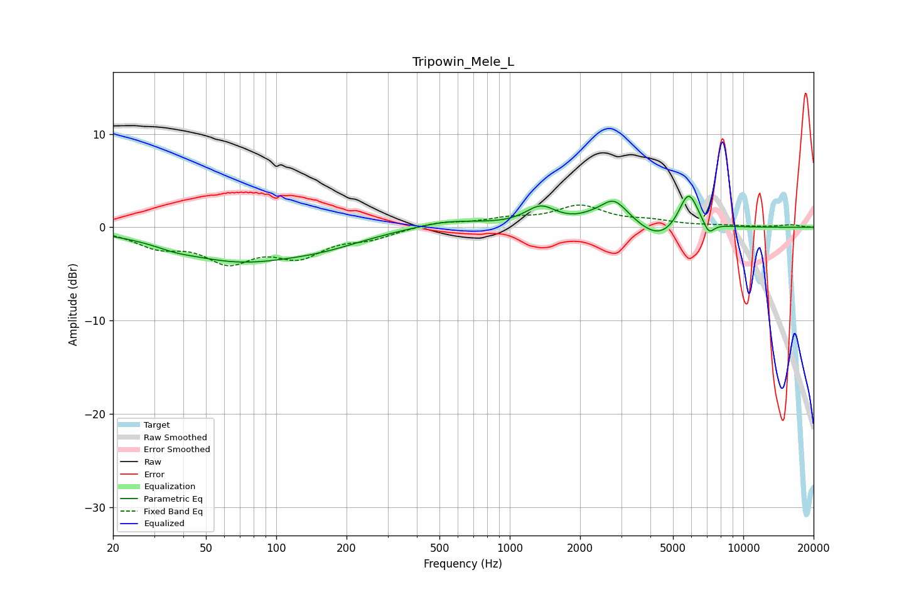

# Tripowin_Mele_L
See [usage instructions](https://github.com/jaakkopasanen/AutoEq#usage) for more options and info.

### Parametric EQs
Apply preamp of -3.4 dB when using parametric equalizer.

|   # | Type    |   Fc (Hz) |    Q |   Gain (dB) |
|-----|---------|-----------|------|-------------|
|   1 | Peaking |        37 | 1.92 |        -0.3 |
|   2 | Peaking |        68 | 0.52 |        -3.4 |
|   3 | Peaking |       162 | 0.78 |        -1   |
|   4 | Peaking |       547 | 0.96 |         0.8 |
|   5 | Peaking |      1355 | 2.18 |         1.9 |
|   6 | Peaking |      2557 | 2.96 |        -1   |
|   7 | Peaking |      2704 | 2.07 |         3.9 |
|   8 | Peaking |      4373 | 1.59 |        -1.8 |
|   9 | Peaking |      5823 | 3.28 |         4.1 |
|  10 | Peaking |      7115 | 5.88 |        -1.3 |

### Fixed Band EQs
When using fixed band (also called graphic) equalizer, apply preamp of **-2.5 dB** (if available) and set gains manually with these parameters.

|   # | Type    |   Fc (Hz) |    Q |   Gain (dB) |
|-----|---------|-----------|------|-------------|
|   1 | Peaking |        31 | 1.41 |        -1.8 |
|   2 | Peaking |        62 | 1.41 |        -3.3 |
|   3 | Peaking |       125 | 1.41 |        -2.7 |
|   4 | Peaking |       250 | 1.41 |        -1   |
|   5 | Peaking |       500 | 1.41 |         0.6 |
|   6 | Peaking |      1000 | 1.41 |         0.8 |
|   7 | Peaking |      2000 | 1.41 |         2.1 |
|   8 | Peaking |      4000 | 1.41 |         0.5 |
|   9 | Peaking |      8000 | 1.41 |         0.1 |
|  10 | Peaking |     16000 | 1.41 |         0.3 |

### Graphs

