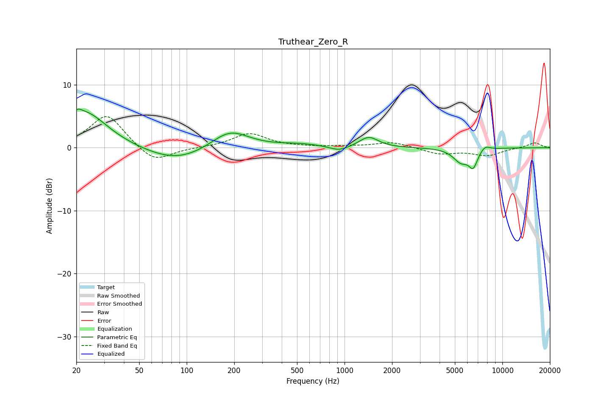

# Truthear_Zero_R
See [usage instructions](https://github.com/jaakkopasanen/AutoEq#usage) for more options and info.

### Parametric EQs
Apply preamp of -6.2 dB when using parametric equalizer.

|   # | Type    |   Fc (Hz) |    Q |   Gain (dB) |
|-----|---------|-----------|------|-------------|
|   1 | Peaking |        20 | 5.76 |         0.8 |
|   2 | Peaking |        22 | 0.98 |         5.8 |
|   3 | Peaking |        87 | 0.72 |        -2.3 |
|   4 | Peaking |       187 | 1.18 |         3.1 |
|   5 | Peaking |       522 | 1.07 |         0.5 |
|   6 | Peaking |       926 | 2.4  |        -0.8 |
|   7 | Peaking |      1424 | 2.39 |         1.7 |
|   8 | Peaking |      5459 | 2.82 |        -2.1 |
|   9 | Peaking |      6533 | 4.8  |        -2.6 |
|  10 | Peaking |      7757 | 4.3  |         0.8 |

### Fixed Band EQs
When using fixed band (also called graphic) equalizer, apply preamp of **-5.0 dB** (if available) and set gains manually with these parameters.

|   # | Type    |   Fc (Hz) |    Q |   Gain (dB) |
|-----|---------|-----------|------|-------------|
|   1 | Peaking |        31 | 1.41 |         5.4 |
|   2 | Peaking |        62 | 1.41 |        -2.6 |
|   3 | Peaking |       125 | 1.41 |        -0   |
|   4 | Peaking |       250 | 1.41 |         2.2 |
|   5 | Peaking |       500 | 1.41 |         0.1 |
|   6 | Peaking |      1000 | 1.41 |         0.2 |
|   7 | Peaking |      2000 | 1.41 |         0.9 |
|   8 | Peaking |      4000 | 1.41 |        -1   |
|   9 | Peaking |      8000 | 1.41 |        -1.2 |
|  10 | Peaking |     16000 | 1.41 |         0.8 |

### Graphs

