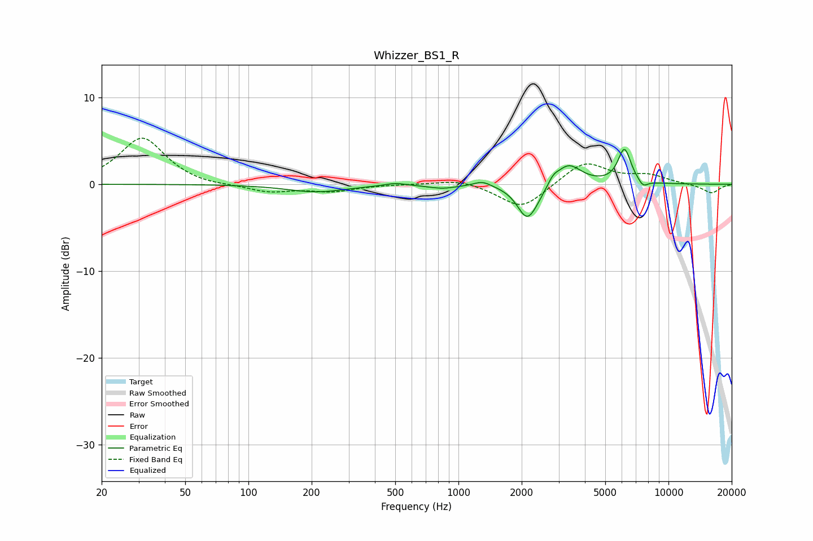

# Whizzer_BS1_R
See [usage instructions](https://github.com/jaakkopasanen/AutoEq#usage) for more options and info.

### Parametric EQs
Apply preamp of -4.1 dB when using parametric equalizer.

|   # | Type    |   Fc (Hz) |    Q |   Gain (dB) |
|-----|---------|-----------|------|-------------|
|   1 | Peaking |       211 | 1.01 |        -0.9 |
|   2 | Peaking |       501 | 2.79 |         0.3 |
|   3 | Peaking |       840 | 2.1  |        -0.4 |
|   4 | Peaking |      1301 | 3.41 |         0.6 |
|   5 | Peaking |      2116 | 3.02 |        -3.5 |
|   6 | Peaking |      2322 | 2.62 |        -0.9 |
|   7 | Peaking |      2823 | 5.91 |         0.7 |
|   8 | Peaking |      3329 | 2.27 |         2.4 |
|   9 | Peaking |      6173 | 4.45 |         4   |
|  10 | Peaking |      7566 | 5.71 |        -0.8 |

### Fixed Band EQs
When using fixed band (also called graphic) equalizer, apply preamp of **-5.4 dB** (if available) and set gains manually with these parameters.

|   # | Type    |   Fc (Hz) |    Q |   Gain (dB) |
|-----|---------|-----------|------|-------------|
|   1 | Peaking |        31 | 1.41 |         5.4 |
|   2 | Peaking |        62 | 1.41 |        -0.3 |
|   3 | Peaking |       125 | 1.41 |        -0.9 |
|   4 | Peaking |       250 | 1.41 |        -0.8 |
|   5 | Peaking |       500 | 1.41 |         0   |
|   6 | Peaking |      1000 | 1.41 |         0.6 |
|   7 | Peaking |      2000 | 1.41 |        -2.9 |
|   8 | Peaking |      4000 | 1.41 |         2.7 |
|   9 | Peaking |      8000 | 1.41 |         1   |
|  10 | Peaking |     16000 | 1.41 |        -1   |

### Graphs

