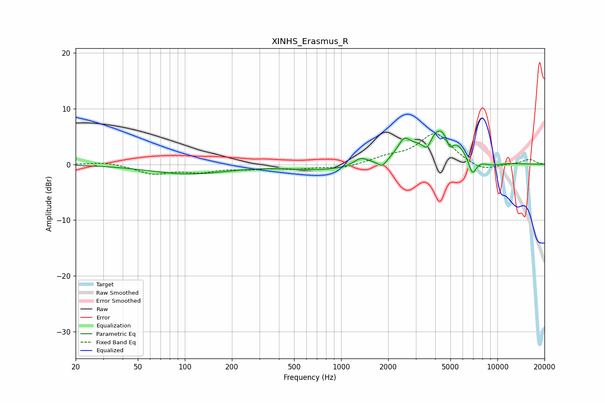

# XINHS_Erasmus_R
See [usage instructions](https://github.com/jaakkopasanen/AutoEq#usage) for more options and info.

### Parametric EQs
Apply preamp of -6.1 dB when using parametric equalizer.

|   # | Type    |   Fc (Hz) |    Q |   Gain (dB) |
|-----|---------|-----------|------|-------------|
|   1 | Peaking |       106 | 0.57 |        -1.7 |
|   2 | Peaking |       811 | 0.69 |        -1   |
|   3 | Peaking |      1338 | 3.21 |         1.3 |
|   4 | Peaking |      1833 | 4.68 |        -1.4 |
|   5 | Peaking |      2531 | 3.59 |         2.7 |
|   6 | Peaking |      3549 | 4.78 |        -2.6 |
|   7 | Peaking |      4304 | 1.19 |         7.2 |
|   8 | Peaking |      4952 | 6    |        -2.6 |
|   9 | Peaking |      6905 | 4.89 |        -3.5 |
|  10 | Peaking |      8958 | 1.79 |        -1   |

### Fixed Band EQs
When using fixed band (also called graphic) equalizer, apply preamp of **-5.6 dB** (if available) and set gains manually with these parameters.

|   # | Type    |   Fc (Hz) |    Q |   Gain (dB) |
|-----|---------|-----------|------|-------------|
|   1 | Peaking |        31 | 1.41 |         0.5 |
|   2 | Peaking |        62 | 1.41 |        -1.6 |
|   3 | Peaking |       125 | 1.41 |        -1.1 |
|   4 | Peaking |       250 | 1.41 |        -0.6 |
|   5 | Peaking |       500 | 1.41 |        -0.7 |
|   6 | Peaking |      1000 | 1.41 |        -0.7 |
|   7 | Peaking |      2000 | 1.41 |         1.1 |
|   8 | Peaking |      4000 | 1.41 |         5.5 |
|   9 | Peaking |      8000 | 1.41 |        -1.4 |
|  10 | Peaking |     16000 | 1.41 |         0.9 |

### Graphs

