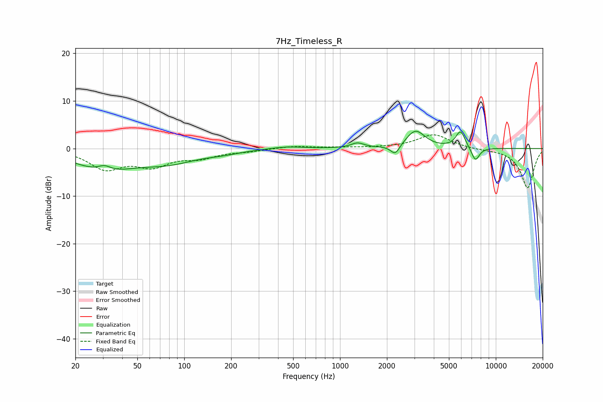

# 7Hz_Timeless_R
See [usage instructions](https://github.com/jaakkopasanen/AutoEq#usage) for more options and info.

### Parametric EQs
Apply preamp of -3.7 dB when using parametric equalizer.

|   # | Type    |   Fc (Hz) |    Q |   Gain (dB) |
|-----|---------|-----------|------|-------------|
|   1 | Peaking |        30 | 0.74 |        -4.2 |
|   2 | Peaking |        31 | 3.42 |         1.2 |
|   3 | Peaking |        80 | 0.77 |        -2.4 |
|   4 | Peaking |       179 | 1.28 |        -0.5 |
|   5 | Peaking |       456 | 1.35 |         0.5 |
|   6 | Peaking |      1295 | 3.42 |         1   |
|   7 | Peaking |      2262 | 4.88 |        -2.1 |
|   8 | Peaking |      3054 | 2.34 |         3.7 |
|   9 | Peaking |      5933 | 4.54 |         3.6 |
|  10 | Peaking |      7398 | 5.18 |        -2.9 |

### Fixed Band EQs
When using fixed band (also called graphic) equalizer, apply preamp of **-3.0 dB** (if available) and set gains manually with these parameters.

|   # | Type    |   Fc (Hz) |    Q |   Gain (dB) |
|-----|---------|-----------|------|-------------|
|   1 | Peaking |        31 | 1.41 |        -4   |
|   2 | Peaking |        62 | 1.41 |        -3.2 |
|   3 | Peaking |       125 | 1.41 |        -1.7 |
|   4 | Peaking |       250 | 1.41 |        -0.5 |
|   5 | Peaking |       500 | 1.41 |         0.5 |
|   6 | Peaking |      1000 | 1.41 |         0.2 |
|   7 | Peaking |      2000 | 1.41 |         0.1 |
|   8 | Peaking |      4000 | 1.41 |         3   |
|   9 | Peaking |      8000 | 1.41 |        -0.2 |
|  10 | Peaking |     16000 | 1.41 |        -8.3 |

### Graphs

