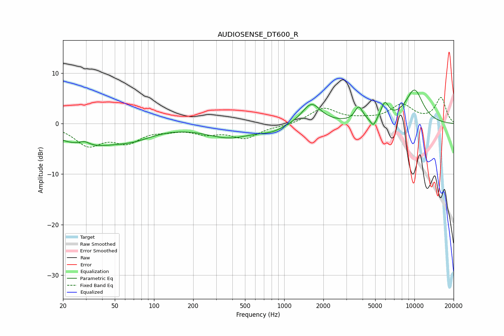

# AUDIOSENSE_DT600_R
See [usage instructions](https://github.com/jaakkopasanen/AutoEq#usage) for more options and info.

### Parametric EQs
Apply preamp of -6.7 dB when using parametric equalizer.

|   # | Type    |   Fc (Hz) |    Q |   Gain (dB) |
|-----|---------|-----------|------|-------------|
|   1 | Peaking |        29 | 3.41 |         0.9 |
|   2 | Peaking |        30 | 0.6  |        -4.1 |
|   3 | Peaking |        70 | 0.89 |        -1.8 |
|   4 | Peaking |       382 | 0.77 |        -2.6 |
|   5 | Peaking |       811 | 1.52 |        -1   |
|   6 | Peaking |      1619 | 1.99 |         4.1 |
|   7 | Peaking |      3738 | 4.67 |         2.8 |
|   8 | Peaking |      4843 | 6    |        -1.8 |
|   9 | Peaking |      5931 | 4.58 |         3.2 |
|  10 | Peaking |     10000 | 1.7  |         6.5 |

### Fixed Band EQs
When using fixed band (also called graphic) equalizer, apply preamp of **-5.3 dB** (if available) and set gains manually with these parameters.

|   # | Type    |   Fc (Hz) |    Q |   Gain (dB) |
|-----|---------|-----------|------|-------------|
|   1 | Peaking |        31 | 1.41 |        -4   |
|   2 | Peaking |        62 | 1.41 |        -3.2 |
|   3 | Peaking |       125 | 1.41 |        -0.8 |
|   4 | Peaking |       250 | 1.41 |        -1.6 |
|   5 | Peaking |       500 | 1.41 |        -2.7 |
|   6 | Peaking |      1000 | 1.41 |        -0.4 |
|   7 | Peaking |      2000 | 1.41 |         3   |
|   8 | Peaking |      4000 | 1.41 |         0.5 |
|   9 | Peaking |      8000 | 1.41 |         3.5 |
|  10 | Peaking |     16000 | 1.41 |         5   |

### Graphs

