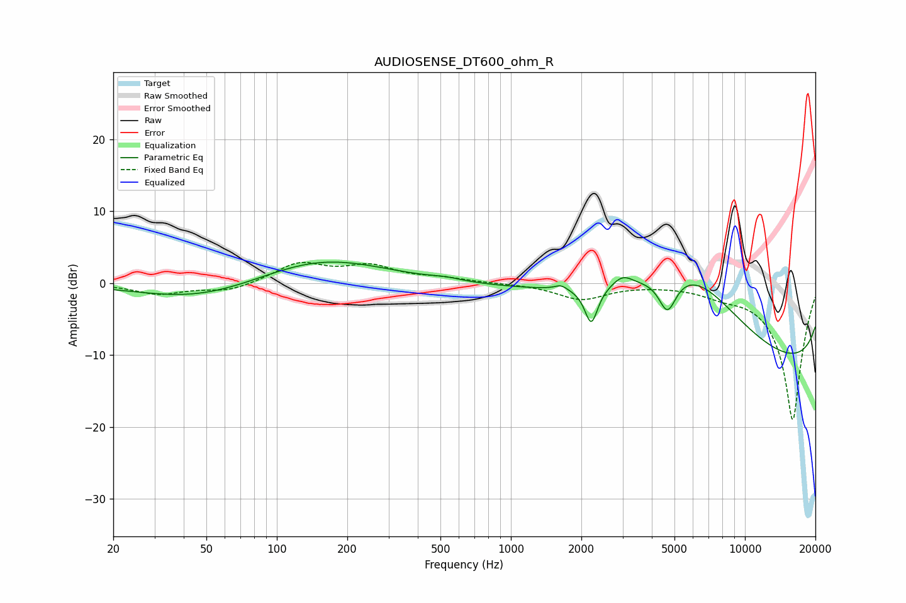

# AUDIOSENSE_DT600_ohm_R
See [usage instructions](https://github.com/jaakkopasanen/AutoEq#usage) for more options and info.

### Parametric EQs
Apply preamp of -3.0 dB when using parametric equalizer.

|   # | Type    |   Fc (Hz) |    Q |   Gain (dB) |
|-----|---------|-----------|------|-------------|
|   1 | Peaking |        25 | 0.61 |         0.5 |
|   2 | Peaking |        44 | 0.49 |        -2.8 |
|   3 | Peaking |       152 | 0.52 |         3.7 |
|   4 | Peaking |       528 | 2.22 |         0.3 |
|   5 | Peaking |      1638 | 5.41 |         0.7 |
|   6 | Peaking |      2205 | 5.15 |        -5.1 |
|   7 | Peaking |      2998 | 3.24 |         1.5 |
|   8 | Peaking |      4667 | 3.74 |        -4.9 |
|   9 | Peaking |      5947 | 0.38 |        16.9 |
|  10 | Peaking |     10000 | 0.18 |       -18   |

### Fixed Band EQs
When using fixed band (also called graphic) equalizer, apply preamp of **-3.0 dB** (if available) and set gains manually with these parameters.

|   # | Type    |   Fc (Hz) |    Q |   Gain (dB) |
|-----|---------|-----------|------|-------------|
|   1 | Peaking |        31 | 1.41 |        -1.5 |
|   2 | Peaking |        62 | 1.41 |        -1.1 |
|   3 | Peaking |       125 | 1.41 |         2.7 |
|   4 | Peaking |       250 | 1.41 |         2.2 |
|   5 | Peaking |       500 | 1.41 |         0.6 |
|   6 | Peaking |      1000 | 1.41 |        -0   |
|   7 | Peaking |      2000 | 1.41 |        -2.2 |
|   8 | Peaking |      4000 | 1.41 |        -0   |
|   9 | Peaking |      8000 | 1.41 |        -1   |
|  10 | Peaking |     16000 | 1.41 |       -19.1 |

### Graphs

