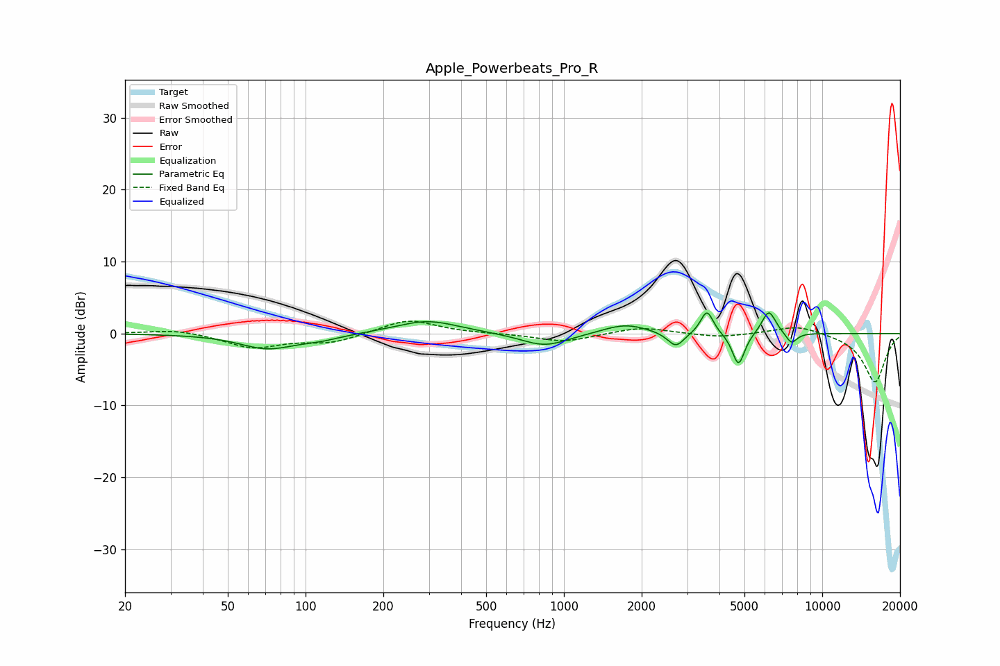

# Apple_Powerbeats_Pro_R
See [usage instructions](https://github.com/jaakkopasanen/AutoEq#usage) for more options and info.

### Parametric EQs
Apply preamp of -3.0 dB when using parametric equalizer.

|   # | Type    |   Fc (Hz) |    Q |   Gain (dB) |
|-----|---------|-----------|------|-------------|
|   1 | Peaking |        71 | 1.33 |        -2.1 |
|   2 | Peaking |       115 | 1.71 |        -0.6 |
|   3 | Peaking |       296 | 1.16 |         1.9 |
|   4 | Peaking |       843 | 1.54 |        -1.9 |
|   5 | Peaking |      1726 | 1.62 |         1.4 |
|   6 | Peaking |      2712 | 4.38 |        -2.1 |
|   7 | Peaking |      3578 | 5.83 |         3.3 |
|   8 | Peaking |      4741 | 5.87 |        -4.6 |
|   9 | Peaking |      6212 | 5.11 |         3.3 |
|  10 | Peaking |      7595 | 6    |        -1.6 |

### Fixed Band EQs
When using fixed band (also called graphic) equalizer, apply preamp of **-1.8 dB** (if available) and set gains manually with these parameters.

|   # | Type    |   Fc (Hz) |    Q |   Gain (dB) |
|-----|---------|-----------|------|-------------|
|   1 | Peaking |        31 | 1.41 |         0.6 |
|   2 | Peaking |        62 | 1.41 |        -1.9 |
|   3 | Peaking |       125 | 1.41 |        -1.2 |
|   4 | Peaking |       250 | 1.41 |         2   |
|   5 | Peaking |       500 | 1.41 |        -0   |
|   6 | Peaking |      1000 | 1.41 |        -1.2 |
|   7 | Peaking |      2000 | 1.41 |         0.9 |
|   8 | Peaking |      4000 | 1.41 |        -0.6 |
|   9 | Peaking |      8000 | 1.41 |         1.2 |
|  10 | Peaking |     16000 | 1.41 |        -6.8 |

### Graphs

