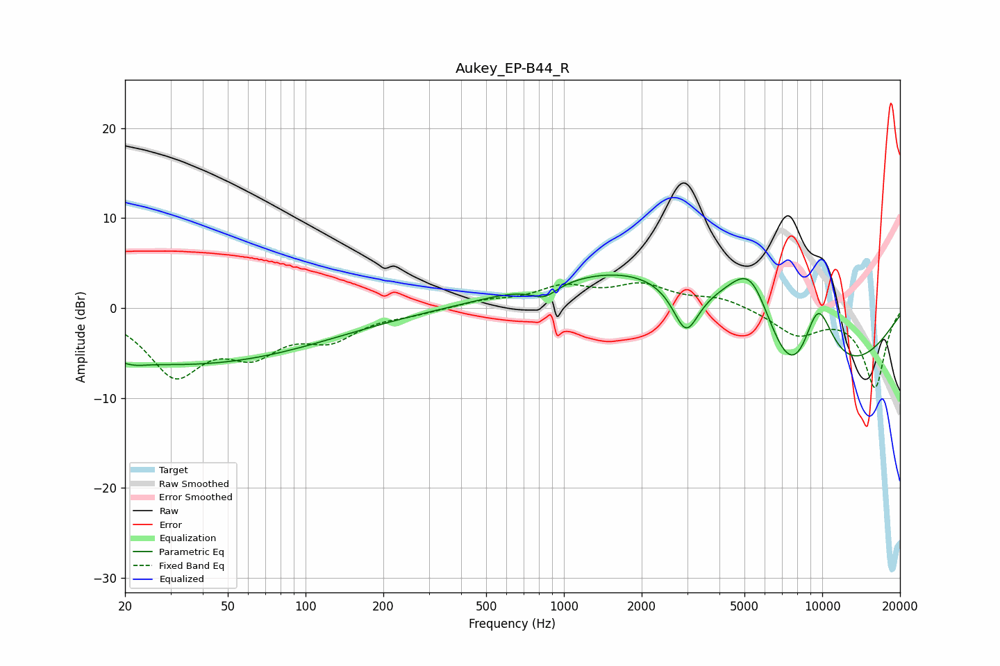

# Aukey_EP-B44_R
See [usage instructions](https://github.com/jaakkopasanen/AutoEq#usage) for more options and info.

### Parametric EQs
Apply preamp of -3.8 dB when using parametric equalizer.

|   # | Type    |   Fc (Hz) |    Q |   Gain (dB) |
|-----|---------|-----------|------|-------------|
|   1 | Peaking |        22 | 2.2  |        -4.4 |
|   2 | Peaking |        23 | 2.2  |         3.9 |
|   3 | Peaking |        34 | 0.25 |        -6.2 |
|   4 | Peaking |       587 | 0.98 |         0.2 |
|   5 | Peaking |       840 | 2.77 |        -1.4 |
|   6 | Peaking |      2232 | 0.4  |         6.9 |
|   7 | Peaking |      2969 | 2.83 |        -5.3 |
|   8 | Peaking |      5314 | 1.19 |        11.5 |
|   9 | Peaking |      7791 | 0.54 |       -19.2 |
|  10 | Peaking |      9574 | 1.59 |        11.8 |

### Fixed Band EQs
When using fixed band (also called graphic) equalizer, apply preamp of **-2.9 dB** (if available) and set gains manually with these parameters.

|   # | Type    |   Fc (Hz) |    Q |   Gain (dB) |
|-----|---------|-----------|------|-------------|
|   1 | Peaking |        31 | 1.41 |        -7   |
|   2 | Peaking |        62 | 1.41 |        -4.1 |
|   3 | Peaking |       125 | 1.41 |        -3   |
|   4 | Peaking |       250 | 1.41 |        -0.5 |
|   5 | Peaking |       500 | 1.41 |         0.7 |
|   6 | Peaking |      1000 | 1.41 |         2.1 |
|   7 | Peaking |      2000 | 1.41 |         2.3 |
|   8 | Peaking |      4000 | 1.41 |         1.1 |
|   9 | Peaking |      8000 | 1.41 |        -2.8 |
|  10 | Peaking |     16000 | 1.41 |        -8.8 |

### Graphs

