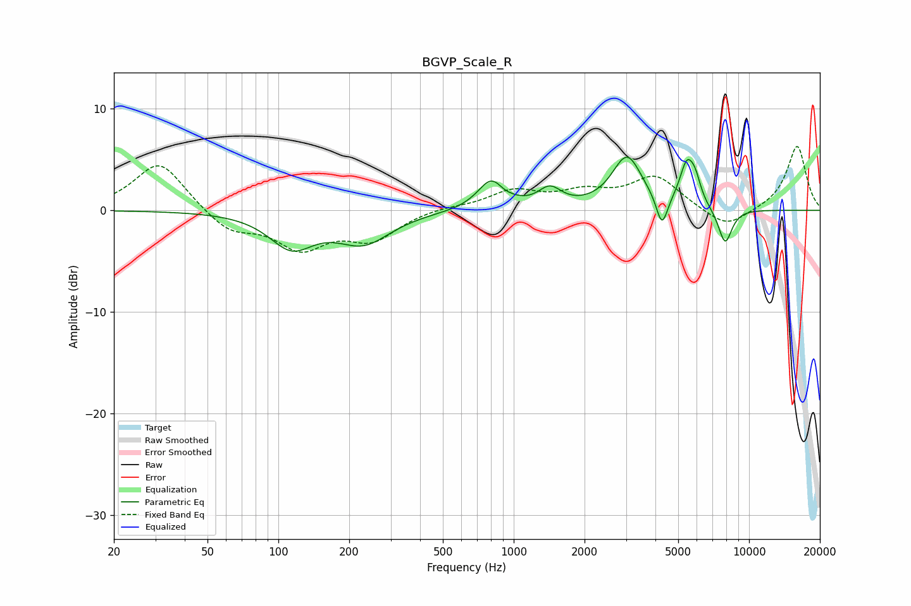

# BGVP_Scale_R
See [usage instructions](https://github.com/jaakkopasanen/AutoEq#usage) for more options and info.

### Parametric EQs
Apply preamp of -5.3 dB when using parametric equalizer.

|   # | Type    |   Fc (Hz) |    Q |   Gain (dB) |
|-----|---------|-----------|------|-------------|
|   1 | Peaking |       114 | 1.5  |        -3.3 |
|   2 | Peaking |       230 | 1.24 |        -3   |
|   3 | Peaking |       806 | 2.45 |         3   |
|   4 | Peaking |       901 | 4.84 |        -0.3 |
|   5 | Peaking |      1424 | 2.88 |         1.8 |
|   6 | Peaking |      3031 | 2.22 |         5.2 |
|   7 | Peaking |      4266 | 5.89 |        -3.1 |
|   8 | Peaking |      5443 | 4.47 |         4   |
|   9 | Peaking |      5914 | 5.71 |         1.8 |
|  10 | Peaking |      7912 | 4.48 |        -3.5 |

### Fixed Band EQs
When using fixed band (also called graphic) equalizer, apply preamp of **-6.4 dB** (if available) and set gains manually with these parameters.

|   # | Type    |   Fc (Hz) |    Q |   Gain (dB) |
|-----|---------|-----------|------|-------------|
|   1 | Peaking |        31 | 1.41 |         4.9 |
|   2 | Peaking |        62 | 1.41 |        -2.1 |
|   3 | Peaking |       125 | 1.41 |        -3.5 |
|   4 | Peaking |       250 | 1.41 |        -2.7 |
|   5 | Peaking |       500 | 1.41 |         0.3 |
|   6 | Peaking |      1000 | 1.41 |         1.8 |
|   7 | Peaking |      2000 | 1.41 |         1.5 |
|   8 | Peaking |      4000 | 1.41 |         3.2 |
|   9 | Peaking |      8000 | 1.41 |        -1.9 |
|  10 | Peaking |     16000 | 1.41 |         6.4 |

### Graphs

