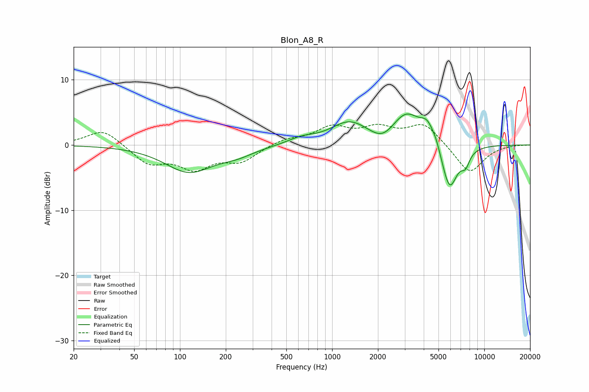

# Blon_A8_R
See [usage instructions](https://github.com/jaakkopasanen/AutoEq#usage) for more options and info.

### Parametric EQs
Apply preamp of -4.8 dB when using parametric equalizer.

|   # | Type    |   Fc (Hz) |    Q |   Gain (dB) |
|-----|---------|-----------|------|-------------|
|   1 | Peaking |       114 | 0.9  |        -4   |
|   2 | Peaking |       237 | 1.23 |        -1.1 |
|   3 | Peaking |       628 | 1.57 |         0.9 |
|   4 | Peaking |      1299 | 1.15 |         3.3 |
|   5 | Peaking |      2147 | 1.84 |        -1.6 |
|   6 | Peaking |      3067 | 1.46 |         4.7 |
|   7 | Peaking |      4247 | 2.93 |         2.8 |
|   8 | Peaking |      4836 | 6    |         0.8 |
|   9 | Peaking |      5912 | 2.58 |        -7.3 |
|  10 | Peaking |      7510 | 4.68 |        -2   |

### Fixed Band EQs
When using fixed band (also called graphic) equalizer, apply preamp of **-3.3 dB** (if available) and set gains manually with these parameters.

|   # | Type    |   Fc (Hz) |    Q |   Gain (dB) |
|-----|---------|-----------|------|-------------|
|   1 | Peaking |        31 | 1.41 |         2.5 |
|   2 | Peaking |        62 | 1.41 |        -2.8 |
|   3 | Peaking |       125 | 1.41 |        -3.3 |
|   4 | Peaking |       250 | 1.41 |        -2.3 |
|   5 | Peaking |       500 | 1.41 |         0.9 |
|   6 | Peaking |      1000 | 1.41 |         2.5 |
|   7 | Peaking |      2000 | 1.41 |         2.3 |
|   8 | Peaking |      4000 | 1.41 |         3.2 |
|   9 | Peaking |      8000 | 1.41 |        -4.4 |
|  10 | Peaking |     16000 | 1.41 |         0.1 |

### Graphs

