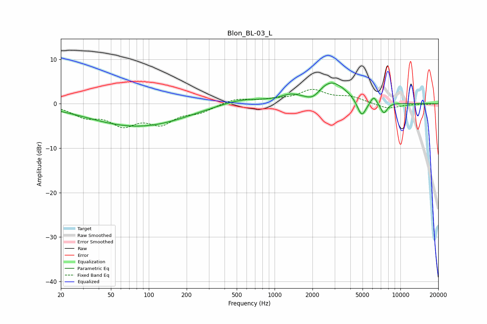

# Blon_BL-03_L
See [usage instructions](https://github.com/jaakkopasanen/AutoEq#usage) for more options and info.

### Parametric EQs
Apply preamp of -4.8 dB when using parametric equalizer.

|   # | Type    |   Fc (Hz) |    Q |   Gain (dB) |
|-----|---------|-----------|------|-------------|
|   1 | Peaking |        34 | 1.23 |        -0   |
|   2 | Peaking |        75 | 0.39 |        -4.7 |
|   3 | Peaking |       152 | 0.59 |        -0.6 |
|   4 | Peaking |       546 | 0.84 |         1.3 |
|   5 | Peaking |      1334 | 1.93 |         1.1 |
|   6 | Peaking |      2029 | 2.2  |        -2.2 |
|   7 | Peaking |      2761 | 1.09 |         5.4 |
|   8 | Peaking |      4921 | 3.82 |        -4.1 |
|   9 | Peaking |      6137 | 5.99 |         1.7 |
|  10 | Peaking |      7387 | 4.71 |        -2.5 |

### Fixed Band EQs
When using fixed band (also called graphic) equalizer, apply preamp of **-3.3 dB** (if available) and set gains manually with these parameters.

|   # | Type    |   Fc (Hz) |    Q |   Gain (dB) |
|-----|---------|-----------|------|-------------|
|   1 | Peaking |        31 | 1.41 |        -2.5 |
|   2 | Peaking |        62 | 1.41 |        -4.2 |
|   3 | Peaking |       125 | 1.41 |        -3.9 |
|   4 | Peaking |       250 | 1.41 |        -1.6 |
|   5 | Peaking |       500 | 1.41 |         1.2 |
|   6 | Peaking |      1000 | 1.41 |         0.7 |
|   7 | Peaking |      2000 | 1.41 |         2.9 |
|   8 | Peaking |      4000 | 1.41 |         1.4 |
|   9 | Peaking |      8000 | 1.41 |        -1.2 |
|  10 | Peaking |     16000 | 1.41 |        -0.1 |

### Graphs

