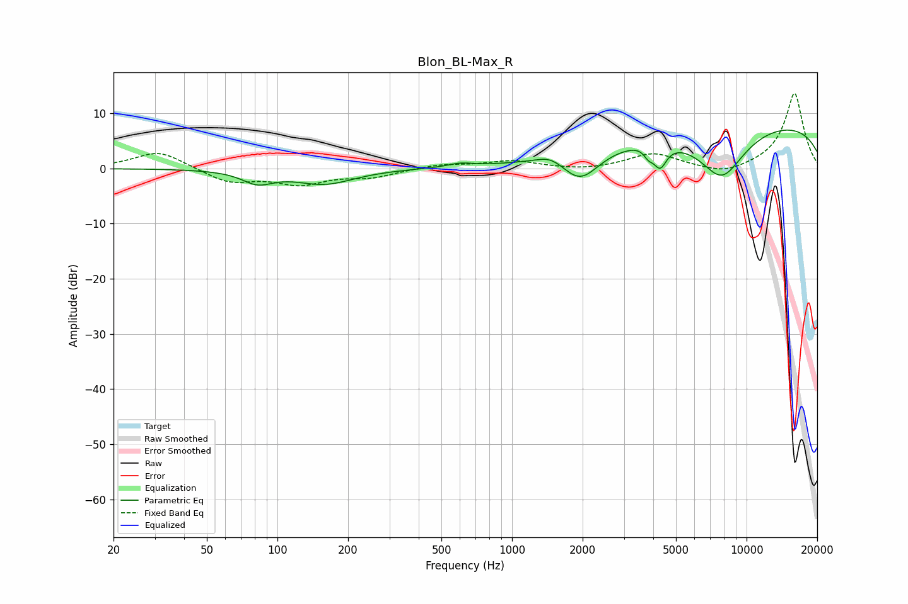

# Blon_BL-Max_R
See [usage instructions](https://github.com/jaakkopasanen/AutoEq#usage) for more options and info.

### Parametric EQs
Apply preamp of -7.0 dB when using parametric equalizer.

|   # | Type    |   Fc (Hz) |    Q |   Gain (dB) |
|-----|---------|-----------|------|-------------|
|   1 | Peaking |        82 | 2.18 |        -2.2 |
|   2 | Peaking |       159 | 1.11 |        -2.7 |
|   3 | Peaking |       602 | 2.73 |         0.7 |
|   4 | Peaking |      1463 | 2.35 |         1.6 |
|   5 | Peaking |      1955 | 1.7  |        -5.5 |
|   6 | Peaking |      3814 | 4.32 |         1.4 |
|   7 | Peaking |      3819 | 6    |        -2.7 |
|   8 | Peaking |      4277 | 5.08 |        -4.1 |
|   9 | Peaking |      7833 | 1.26 |        -9.6 |
|  10 | Peaking |     10000 | 0.18 |         8.7 |

### Fixed Band EQs
When using fixed band (also called graphic) equalizer, apply preamp of **-13.7 dB** (if available) and set gains manually with these parameters.

|   # | Type    |   Fc (Hz) |    Q |   Gain (dB) |
|-----|---------|-----------|------|-------------|
|   1 | Peaking |        31 | 1.41 |         3.2 |
|   2 | Peaking |        62 | 1.41 |        -2.5 |
|   3 | Peaking |       125 | 1.41 |        -2.6 |
|   4 | Peaking |       250 | 1.41 |        -1.4 |
|   5 | Peaking |       500 | 1.41 |         0.7 |
|   6 | Peaking |      1000 | 1.41 |         1.3 |
|   7 | Peaking |      2000 | 1.41 |        -0.4 |
|   8 | Peaking |      4000 | 1.41 |         2.7 |
|   9 | Peaking |      8000 | 1.41 |        -1.4 |
|  10 | Peaking |     16000 | 1.41 |        13.7 |

### Graphs

