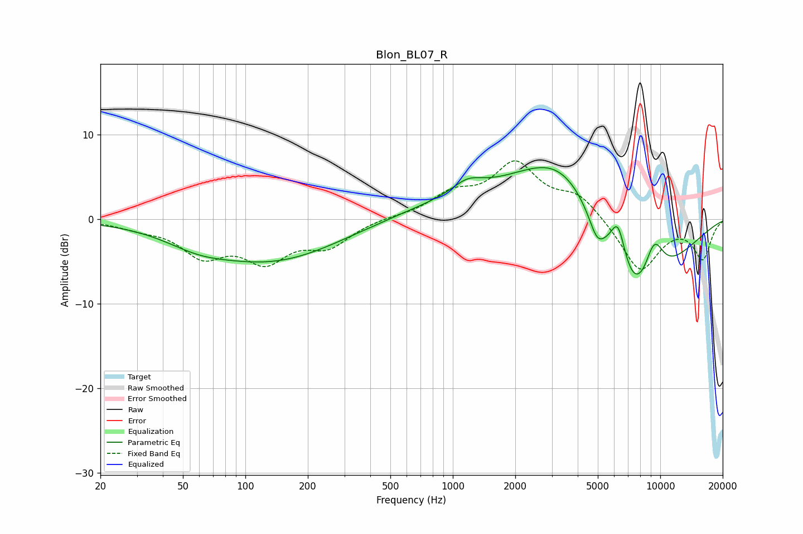

# Blon_BL07_R
See [usage instructions](https://github.com/jaakkopasanen/AutoEq#usage) for more options and info.

### Parametric EQs
Apply preamp of -6.2 dB when using parametric equalizer.

|   # | Type    |   Fc (Hz) |    Q |   Gain (dB) |
|-----|---------|-----------|------|-------------|
|   1 | Peaking |        59 | 0.96 |        -1.3 |
|   2 | Peaking |       135 | 0.43 |        -4.9 |
|   3 | Peaking |       980 | 0.45 |         1.5 |
|   4 | Peaking |      1176 | 1.97 |         1.5 |
|   5 | Peaking |      3384 | 0.56 |         8.2 |
|   6 | Peaking |      3458 | 0.93 |         1.3 |
|   7 | Peaking |      4954 | 3.64 |        -2.5 |
|   8 | Peaking |      6260 | 3.68 |         5.2 |
|   9 | Peaking |      7520 | 0.7  |       -13.6 |
|  10 | Peaking |      9330 | 2.51 |         5.3 |

### Fixed Band EQs
When using fixed band (also called graphic) equalizer, apply preamp of **-7.0 dB** (if available) and set gains manually with these parameters.

|   # | Type    |   Fc (Hz) |    Q |   Gain (dB) |
|-----|---------|-----------|------|-------------|
|   1 | Peaking |        31 | 1.41 |        -0.8 |
|   2 | Peaking |        62 | 1.41 |        -3.9 |
|   3 | Peaking |       125 | 1.41 |        -4.4 |
|   4 | Peaking |       250 | 1.41 |        -2.9 |
|   5 | Peaking |       500 | 1.41 |         0.2 |
|   6 | Peaking |      1000 | 1.41 |         2.6 |
|   7 | Peaking |      2000 | 1.41 |         6.2 |
|   8 | Peaking |      4000 | 1.41 |         2.7 |
|   9 | Peaking |      8000 | 1.41 |        -6.2 |
|  10 | Peaking |     16000 | 1.41 |        -4.6 |

### Graphs

