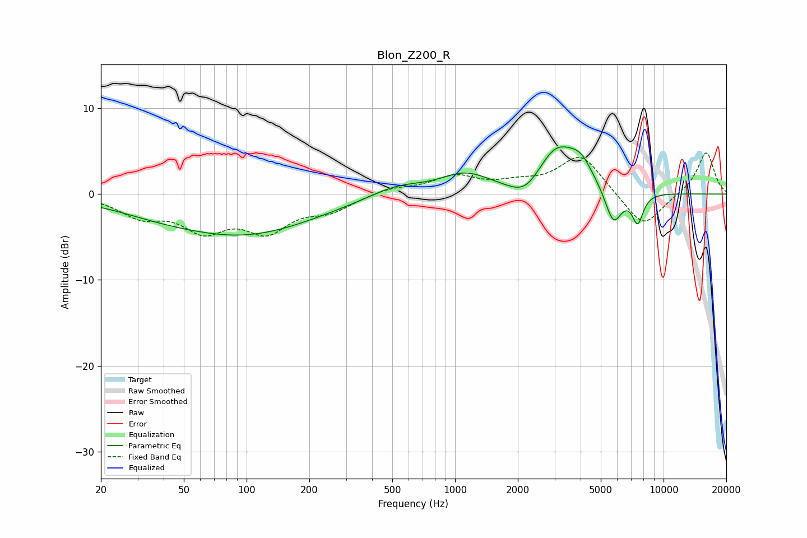

# Blon_Z200_R
See [usage instructions](https://github.com/jaakkopasanen/AutoEq#usage) for more options and info.

### Parametric EQs
Apply preamp of -5.6 dB when using parametric equalizer.

|   # | Type    |   Fc (Hz) |    Q |   Gain (dB) |
|-----|---------|-----------|------|-------------|
|   1 | Peaking |        36 | 0.59 |        -0.7 |
|   2 | Peaking |        60 | 0.93 |         0.2 |
|   3 | Peaking |        94 | 0.4  |        -4.7 |
|   4 | Peaking |       523 | 1.06 |         1.3 |
|   5 | Peaking |      1119 | 1.2  |         2.2 |
|   6 | Peaking |      2194 | 1.73 |        -2.5 |
|   7 | Peaking |      3057 | 1.34 |         5.7 |
|   8 | Peaking |      4026 | 2.58 |         2   |
|   9 | Peaking |      5748 | 3.4  |        -4.2 |
|  10 | Peaking |      7517 | 5.03 |        -3.4 |

### Fixed Band EQs
When using fixed band (also called graphic) equalizer, apply preamp of **-4.9 dB** (if available) and set gains manually with these parameters.

|   # | Type    |   Fc (Hz) |    Q |   Gain (dB) |
|-----|---------|-----------|------|-------------|
|   1 | Peaking |        31 | 1.41 |        -2.3 |
|   2 | Peaking |        62 | 1.41 |        -3.7 |
|   3 | Peaking |       125 | 1.41 |        -3.9 |
|   4 | Peaking |       250 | 1.41 |        -1.7 |
|   5 | Peaking |       500 | 1.41 |         0.7 |
|   6 | Peaking |      1000 | 1.41 |         1.9 |
|   7 | Peaking |      2000 | 1.41 |         0.9 |
|   8 | Peaking |      4000 | 1.41 |         4.6 |
|   9 | Peaking |      8000 | 1.41 |        -4.1 |
|  10 | Peaking |     16000 | 1.41 |         5   |

### Graphs

